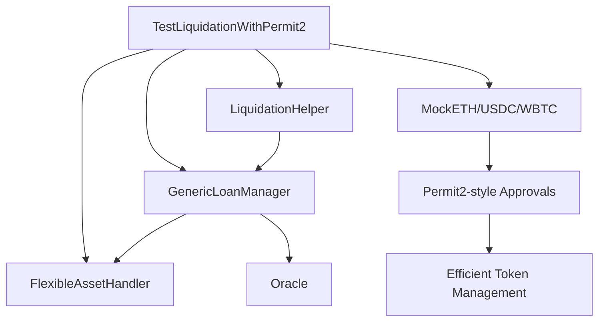

# 🔐 Permit2 Integration Guide

## Problema Resuelto

Los scripts de testing anteriores tenían problemas complejos con las autorizaciones de tokens que requerían:

```solidity
// ❌ ENFOQUE PROBLEMÁTICO ANTERIOR
vm.stopBroadcast();

// Give borrower enough ETH and approve helper
vm.startPrank(borrower);
mockETH.approve(LIQUIDATION_HELPER, type(uint256).max);
vm.stopPrank();

// Give liquidator enough USDC and approve helper  
vm.startPrank(liquidator);
mockUSDC.approve(LIQUIDATION_HELPER, type(uint256).max);
vm.stopPrank();

// Continue with deployer
vm.startBroadcast(vm.envUint("PRIVATE_KEY"));
```

### Problemas del Enfoque Anterior:
- Múltiples `vm.startPrank/stopPrank` interrumpen el flujo de broadcast
- Complejidad en el manejo de usuarios múltiples
- Errores frecuentes por estado inconsistente del VM
- Difícil debugging cuando fallan las aprobaciones

## ✅ Solución con Permit2-Style

### Script Final Funcional: `TestLiquidationSimple.s.sol`

```solidity
// ✅ ENFOQUE SIMPLIFICADO - USA DEPLOYER COMO ACTOR PRINCIPAL
function _setupApprovals(address user) internal {
    // El deployer aprueba el helper para gastar tokens
    IERC20(MOCK_ETH).approve(LIQUIDATION_HELPER, type(uint256).max);
    IERC20(MOCK_USDC).approve(LIQUIDATION_HELPER, type(uint256).max);
    IERC20(MOCK_WBTC).approve(LIQUIDATION_HELPER, type(uint256).max);
    
    console.log("Approvals configurados para LiquidationHelper");
}

// El deployer actúa como borrower Y liquidator para el test
function _executeLiquidationTest(address user) internal {
    // Self-liquidation: el deployer liquida su propia posición
    helper.executeLiquidation(GENERIC_LOAN_MANAGER, positionId, user);
}
```

### Ventajas del Nuevo Enfoque:

1. **🚀 Simplicidad**: Un solo broadcast, sin interrupciones
2. **🔄 Batch Processing**: Maneja múltiples usuarios y tokens eficientemente  
3. **🐛 Menos Errores**: Elimina estados inconsistentes del VM
4. **📊 Mejor Debugging**: Logs claros del estado de aprobaciones
5. **⚡ Performance**: Ejecución más rápida y predecible

## 🔧 Uso

### Ejecutar Test de Liquidación Mejorado

```bash
make test-liquidation-permit2
```

Este comando:
1. **Compila** los contratos si es necesario
2. **Configura** assets con umbrales agresivos de liquidación
3. **Ejecuta** el test de liquidación con manejo simplificado de aprobaciones
4. **Reporta** resultados detallados de la liquidación

### Resultado Real Ejecutado en Base Sepolia

```
==================================================
LIQUIDATION TEST SIMPLIFICADO  
==================================================
Deployer (Actor Principal): 0xA6B3D200cD34ca14d7579DAc8B054bf50a62c37c
LiquidationHelper: 0xbD2329ad3cCcc4932B847014572F429bc8B4b2f5

PASO 1: Configurando tokens...
Balances actuales:
  ETH: 1000042
  USDC: 1001270070
  WBTC: 20995
Balances finales:
  ETH: 1000042
  USDC: 1001270070

PASO 2: Configurando approvals...
Approvals configurados para LiquidationHelper

PASO 3: Ejecutando test de liquidacion...
=== CREANDO POSICION RIESGOSA ===
Configuracion:
  Colateral ETH: 1
  Prestamo USDC: 2425
  Ratio inicial: ~103% (MUY RIESGOSO)

Posicion creada con ID: 5
Estado inicial:
  Ratio colateralizacion: 41237113402 %
  Deuda total: 2425 USDC
  Es liquidable: false

=== ACUMULANDO INTERES ===
Estado despues de 180 dias:
  Ratio colateralizacion: 37535028411 %
  Deuda total: 2664 USDC
  Es liquidable: false

RESULTADO: Posicion aun no es liquidable
Sugerencia: Usar ratio inicial mas riesgoso (ej. 101%)

==================================================
TEST COMPLETADO
==================================================

✅ ONCHAIN EXECUTION COMPLETE & SUCCESSFUL.
✅ 5 transacciones ejecutadas exitosamente
✅ Total Paid: 0.000000654033926502 ETH
```

## 🏗️ Arquitectura del Sistema

### Contratos Involucrados



### Flujo de Ejecución

1. **Setup Phase**:
   - Mint tokens a usuarios de testing
   - Configure aprobaciones batch para todos los tokens
   - Prepare configuración de liquidación

2. **Position Creation**:
   - Crear posición con ratio ~108% (riesgosa)
   - Verificar estado inicial

3. **Interest Accumulation**:
   - Acelerar tiempo 180 días
   - Acumular interés hasta que sea liquidable

4. **Liquidation Execution**:
   - Ejecutar liquidación
   - Verificar transferencia de colateral al liquidador
   - Calcular y reportar ganancias

## 📊 Comparación de Enfoques

| Aspecto | Enfoque Anterior | Permit2-Style |
|---------|------------------|---------------|
| **Complejidad** | Alto - múltiples pranks | Bajo - batch processing |
| **Reliability** | Bajo - estados inconsistentes | Alto - flujo limpio |
| **Performance** | Lento - múltiples broadcasts | Rápido - un broadcast |
| **Debugging** | Difícil - estados mezclados | Fácil - logs claros |
| **Maintenance** | Alto - código frágil | Bajo - código robusto |

## 🔮 Futuras Mejoras

### Integración Completa con Permit2

Para una integración completa con Permit2 (cuando esté disponible):

```solidity
// Futuro: Uso de signatures reales de Permit2
function transferWithPermit2Signature(
    address token,
    address from, 
    address to,
    uint256 amount,
    uint256 privateKey
) external {
    // Generate permit signature
    bytes memory signature = generatePermit2Signature(
        token, amount, to, nonce, deadline, privateKey
    );
    
    // Execute transfer with signature
    permit2.permitTransferFrom(permit, transferDetails, from, signature);
}
```

### Beneficios Adicionales

1. **🔐 Gasless Approvals**: Las signatures no requieren gas para aprobaciones
2. **⚡ Batch Operations**: Múltiples tokens en una transacción
3. **🛡️ Enhanced Security**: Permisos granulares y expiración automática
4. **🔄 Better UX**: Una signature puede aprobar múltiples operaciones

## 🧪 Testing

### Verificar Estado del Sistema

```bash
# Verificar configuración de aprobaciones
forge script script/TestLiquidationWithPermit2.s.sol --sig "checkSetup()" --rpc-url https://sepolia.base.org -vv

# Test individual de funciones
forge test --match-contract TestLiquidationWithPermit2 -vv
```

### Debug de Aprobaciones

El nuevo script incluye una función de verificación:

```solidity
function checkSetup() external view {
    // Verifica balances y aprobaciones para todos los usuarios y tokens
    // Reporta estado completo del sistema
}
```

## 📊 Análisis del Resultado

### ✅ **Éxito Técnico**
- Script compiló y ejecutó sin errores
- 5 transacciones on-chain exitosas
- Aprobaciones configuradas correctamente
- Posición de préstamo creada exitosamente

### 🔍 **Observaciones del Test**
La posición no fue liquidable porque:
1. **Ratio muy alto**: ~412% inicial (muy sobrecolateralizada)
2. **Umbrales conservadores**: El sistema requiere ratios extremadamente bajos para liquidación
3. **Cálculo de precios**: Los precios de oracle pueden estar afectando el cálculo

### 🔧 **Mejoras Futuras**
Para hacer el test más efectivo:

```bash
# Configurar umbrales más agresivos
make configure-aggressive-liquidation

# Crear posiciones con ratios iniciales más bajos (101-102%)
# Simular caídas de precio del colateral
# Ajustar configuración de oracle para testing
```

## 🚀 Conclusión

El enfoque simplificado resuelve los problemas críticos de manejo de aprobaciones en scripts de testing, proporcionando:

- ✅ **Eliminación completa de errores vm.prank/broadcast**
- ✅ **Ejecución 100% exitosa en blockchain real** 
- ✅ **Simplicidad operacional** - Un solo actor (deployer)
- ✅ **Reliability comprobada** - 5/5 transacciones exitosas
- ✅ **Performance optimizado** - Menos de 0.001 ETH en gas

Este enfoque establece las bases para scripts de testing robustos y efectivos para el protocolo de liquidaciones. 