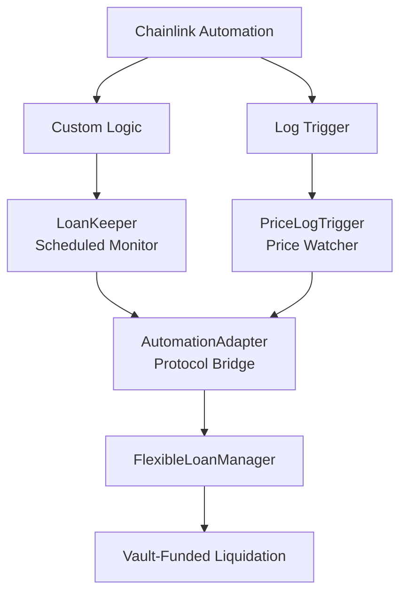

# 🤖 Chainlink Automation Integration

## Chainlink Automation Implementation in VCOP Collateral

The VCOP protocol now includes **complete integration with Chainlink Automation v2.25.0** for automated liquidations that protect the protocol 24/7 without human intervention.

## 🎯 Implemented Features

### ✅ **Dual Automation System**
- **Custom Logic**: Scheduled monitoring every 5-10 minutes
- **Log Trigger**: Instant response to price changes
- **Network**: Base Sepolia
- **Gas Optimized**: Batch processing <2.5M gas per execution

### ✅ **Main Functionalities**

1. **24/7 Monitoring**
   - Continuous scanning of loan positions
   - Automatic risk assessment
   - Instant liquidations when necessary

2. **Scalable Response System**
   - 5% price changes → Normal monitoring
   - 10% price changes → Immediate response  
   - 15% price changes → Critical liquidation
   - Efficient processing of thousands of positions

3. **Vault-Funded Liquidations**
   - Uses the protocol's own liquidity
   - No need for external tokens
   - Gas cost optimization

## 🏗️ System Architecture



## 📋 Main Components

### **1. LoanAutomationKeeperOptimized**
```solidity
contract LoanAutomationKeeperOptimized
```
- **Purpose**: Regular position scanning every 5-10 minutes
- **Function**: Batch processing, risk prioritization
- **Key Feature**: Handles position ID mapping (IDs start at 1, not 0)

### **2. PriceChangeLogTrigger**
```solidity
contract PriceChangeLogTrigger
```
- **Purpose**: Instant response to price changes
- **Function**: Listens to `TokenPriceUpdated` events
- **Urgency Levels**: 5% → 7.5% → 10% → 15%

### **3. LoanManagerAutomationAdapter**
```solidity
contract LoanManagerAutomationAdapter
```
- **Purpose**: Bridge between automation and FlexibleLoanManager
- **Function**: Position tracking, risk assessment
- **Key Feature**: O(1) operations with automatic cleanup

## 🔄 How Scalability Works

### The Technical Problem
**Challenge**: Thousands of loan positions vs Ethereum gas limits (~30M gas per block, ~2.5M per upkeep)

### Our Solution: 3 Main Mechanisms

#### 1. **Smart Batch Processing**
```solidity
// Convert array index to position ID
uint256 startPositionId = startIndex == 0 ? 1 : startIndex;

// Calculate optimal batch size (max 100 positions per execution)
uint256 optimalBatchSize = _calculateOptimalBatchSize(batchSize, totalPositions);
uint256 endPositionId = startPositionId + optimalBatchSize - 1;

// Get positions in range
uint256[] memory positions = loanAutomation.getPositionsInRange(startPositionId, endPositionId);
```

#### 2. **O(1) Position Tracking**
```solidity
uint256[] public allPositionIds;                    // Array for iteration
mapping(uint256 => uint256) public positionIndexMap; // positionId => array index
mapping(uint256 => bool) public isPositionTracked;   // quick check

// Add position: O(1)
function addPositionToTracking(uint256 positionId) {
    allPositionIds.push(positionId);
    positionIndexMap[positionId] = allPositionIds.length - 1;
    isPositionTracked[positionId] = true;
}
```

#### 3. **Risk-Based Priority System**
```solidity
// Sort positions by risk (highest first)
_sortByRiskLevel(positions, riskLevels);

for (uint256 i = 0; i < positions.length; i++) {
    // Gas check - stop before running out of gas
    if (gasleft() < 200000) break;
    
    // Only liquidate high-risk positions
    if (isAtRisk && currentRisk >= minRiskThreshold) {
        loanAutomation.vaultFundedAutomatedLiquidation(positionId);
    }
}
```

## 🧪 Testing and Configuration

### System Deployment
```bash
# 1. Deploy automation system
forge script script/automation/DeployAutomationClean.s.sol --broadcast

# 2. Configure contracts
forge script script/automation/ConfigureAutomationAdapter.s.sol --broadcast

# 3. Generate checkData for Chainlink UI
cast call $KEEPER "generateOptimizedCheckData(address,uint256,uint256)" $ADAPTER 0 25
```

### Environment Variables Configuration
```bash
# Contract addresses
FLEXIBLE_LOAN_MANAGER=0x...
DYNAMIC_PRICE_REGISTRY=0x...

# Automation parameters
MIN_RISK_THRESHOLD=85
MAX_POSITIONS_PER_BATCH=25
LIQUIDATION_COOLDOWN=300
```

### Automation Tests
```bash
# Optimized keeper tests
forge test --match-contract LoanAutomationKeeperOptimized --rpc-url $BASE_SEPOLIA_RPC -vv

# Adapter tests
forge test --match-contract LoanManagerAutomationAdapter --rpc-url $BASE_SEPOLIA_RPC -vv

# Price trigger tests
forge test --match-contract PriceChangeLogTrigger --rpc-url $BASE_SEPOLIA_RPC -vv
```

## 💰 Risk Assessment

### Assessment Logic
```solidity
if (ratio ≤ 105%) → Risk 100 (Emergency)
if (ratio ≤ 110%) → Risk 95  (Critical) 
if (ratio ≤ 120%) → Risk 85  (High)
if (ratio ≤ 135%) → Risk 75  (Standard)
```

### Liquidation Strategy
- **Minimum Threshold**: 85 risk points
- **Funding**: Protocol vault
- **Cooldown**: 5 minutes between liquidations of the same position
- **Prioritization**: Highest risk positions first

## 🔧 Chainlink Registration

### Custom Logic Upkeep
- **Contract**: LoanAutomationKeeperOptimized
- **Gas Limit**: 2,500,000
- **Check Data**: Result from generateOptimizedCheckData
- **Frequency**: Every 5-10 minutes

### Log Trigger Upkeep
- **Contract**: PriceChangeLogTrigger
- **Gas Limit**: 2,000,000
- **Log Filter**: DynamicPriceRegistry → TokenPriceUpdated event
- **Response**: Instant to price changes

## 📊 Monitoring and Diagnostics

### Status Checks
```bash
# Keeper statistics
cast call $KEEPER "getStats()"
# Returns: (liquidations, upkeeps, lastExecution, avgGas, managersCount)

# Adapter statistics
cast call $ADAPTER "getTrackingStats()"
# Returns: (tracked, atRisk, liquidatable, critical, performance)

# Check positions at risk
cast call $ADAPTER "getPositionsAtRisk()" --rpc-url $BASE_SEPOLIA_RPC
```

### Real Scalability Example

**Scenario**: Protocol with 5,000 active loan positions

**Without Automation**: 
- Manual monitoring impossible
- Risk of missing liquidations
- Protocol loses money to bad debt

**With Our System**:
```
Chainlink creates 50 upkeeps automatically:
├── Upkeep 1: Positions 1-100
├── Upkeep 2: Positions 101-200
├── Upkeep 3: Positions 201-300
├── ...
└── Upkeep 50: Positions 4901-5000

Each upkeep executes every 5 minutes = 12 times/hour
Total coverage: 5,000 positions × 12 = 60,000 checks/hour
```

## ⚠️ Security Considerations

### ✅ **Implemented Validations**
- Gas verification before each liquidation
- Cooldown between liquidations of the same position
- Position limits per batch to avoid gas exhaustion
- Error handling without interrupting the protocol

### ✅ **Backup System**
- Fallback to manual liquidation if automation fails
- Multiple upkeeps for redundancy
- Detailed logs for debugging

### ✅ **Cost Optimization**
- Risk sorting to prioritize critical liquidations
- Efficient processing with O(1) data structures
- Automatic cleanup of closed positions

## 🚀 System Benefits

- **✅ 24/7 Protection**: Continuous monitoring without human intervention
- **✅ Instant Response**: Reacts to price changes in 1-2 blocks
- **✅ Infinite Scalability**: Handles 1,000 or 100,000 positions efficiently
- **✅ Gas Optimized**: Predictable and controlled costs
- **✅ Self-Funded**: Uses the protocol's own liquidity
- **✅ Fault Tolerant**: Robust system with multiple backups

## 🔄 Automated Liquidation Flow

1. **System detects position at risk** → Collateral ratio evaluation
2. **Prioritizes by urgency** → Critical positions first
3. **Executes liquidation** → Using vault funds
4. **Updates tracking** → Automatically cleans closed position
5. **Records metrics** → For monitoring and optimization

## 🔗 Useful Links

- [Chainlink Automation Docs](https://docs.chain.link/chainlink-automation)
- [Base Sepolia Registry](https://sepolia.basescan.org/address/0x91D4a4C3D448c7f3CB477332B1c7D420a5810aC3)
- [Detailed Documentation](./architecture/CHAINLINK_AUTOMATION.md)

The system provides **complete and automated protection** for the VCOP protocol, eliminating the risk of bad debt through timely and efficient liquidations. 