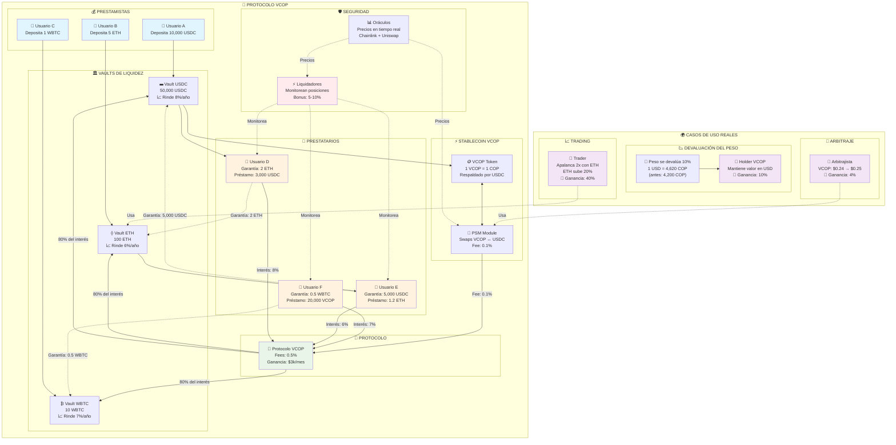

# 🔍 CÓMO FUNCIONA EL PROTOCOLO

## 🎯 **CONCEPTO SIMPLE**

VCOP es como un "banco digital" que te permite:
- **Prestar dinero** usando criptomonedas como garantía
- **Ganar intereses** prestando tu dinero a otros
- **Protegerte** de la devaluación del peso colombiano
- **Especular** con los movimientos de precios

## 💰 **FORMAS DE GANAR DINERO**

### **1. 🏦 PRESTAMISTAS (Proveedores de Liquidez)**
```
¿Qué haces?: Depositas USDC, ETH o WBTC en el protocolo
¿Cómo ganas?: Cobras intereses a quienes piden prestado

Ejemplo:
- Depositas 10,000 USDC
- El protocolo lo presta al 8% anual
- Ganas ~800 USDC al año (pasivamente)
```

### **2. 💸 TRADERS/ESPECULADORES**
```
¿Qué haces?: Usas tu cripto como garantía para pedir prestado otras criptos
¿Cómo ganas?: Especulas con los precios

Ejemplo de Apalancamiento:
- Tienes 1 ETH ($2,000)
- Lo usas como garantía para pedir $1,500 USDC
- Compras más ETH con esos $1,500
- Si ETH sube 20%, ganas $300 extra (¡15% más ganancia!)

Ejemplo de Protección contra Devaluación:
- Tienes pesos colombianos (COP)
- Los cambias por VCOP (stablecoin vinculada al peso)
- Si el peso se devalúa vs el dólar, VCOP mantiene su valor
- ¡Proteges tu dinero de la inflación!
```

### **3. ⚡ LIQUIDADORES**
```
¿Qué haces?: Vigilas posiciones riesgosas y las liquidas
¿Cómo ganas?: Cobras bonificaciones por liquidar

Ejemplo:
- Alguien pidió $1,000 prestado con garantía de $1,200
- El precio baja y la garantía vale solo $1,100
- Tú liquidas la posición
- Ganas ~$50-100 de bonificación (5-10%)
```

### **4. 🚀 ARBITRAJISTAS**
```
¿Qué haces?: Aprovechas diferencias de precios entre mercados
¿Cómo ganas?: Compras barato en un lado, vendes caro en otro

Ejemplo:
- VCOP vale $0.24 en el protocolo
- VCOP vale $0.25 en otro exchange
- Compras VCOP en el protocolo, vendes en el exchange
- Ganas $0.01 por cada VCOP (¡4% de ganancia!)
```

## 💡 **OPORTUNIDADES ESPECIALES**

### **📉 CUANDO EL PESO SE DEVALÚA**
```
Escenario: El peso colombiano se devalúa 10% vs el dólar

Para VCOP holders:
✅ VCOP mantiene su valor en dólares
✅ Tienes más poder de compra en Colombia
✅ Te proteges de la inflación

Para traders inteligentes:
✅ Pueden hacer "short" al peso usando VCOP
✅ Ganan cuando el peso se debilita
✅ Protegen su patrimonio
```

### **💎 ESTRATEGIAS AVANZADAS**
```
1. "Carry Trade": 
   - Pide prestado VCOP al 5%
   - Invierte en crypto que da 15%
   - Ganancia neta: 10%

2. "Hedge de Portafolio":
   - Tienes inversiones en pesos
   - Compras VCOP como seguro
   - Si el peso baja, VCOP compensa

3. "Yield Farming":
   - Provees liquidez ETH-USDC
   - Ganas fees de trading + intereses
   - Rendimientos del 8-15% anual
```

## 🏢 **CÓMO GANA EL PROTOCOLO**

```
1. Fees de Transacción: 0.1-0.5% por operación
2. Spread de Intereses: Diferencia entre lo que paga y cobra
3. Fees de Liquidación: Porcentaje de las liquidaciones
4. Fees del PSM: Comisión por swaps VCOP↔USDC

Ejemplo mensual:
- $1M en volumen de préstamos
- 0.5% en fees = $5,000
- Gastos operativos: ~$2,000  
- Ganancia neta: $3,000/mes
```

## 🛡️ **SEGURIDAD Y PROTECCIONES**

```
Para Prestamistas:
✅ Tu dinero está sobre-colateralizado (120-150%)
✅ Liquidaciones automáticas protegen tu capital
✅ Contratos auditados y probados

Para Prestatarios:
✅ Conservas la propiedad de tu garantía
✅ Puedes agregar más garantía si el precio baja
✅ Solo pagas interés sobre lo que usas

Para el Protocolo:
✅ Reservas de emergencia
✅ Mecanismos de pausa automática
✅ Oráculos redundantes para precios
```

## 📊 **EJEMPLOS PRÁCTICOS PASO A PASO**

### **💼 Caso 1: Prestamista Conservador**
```
María tiene $10,000 USDC y quiere generar ingresos pasivos

Paso 1: Deposita 10,000 USDC en el vault
Paso 2: El protocolo presta su dinero a traders
Paso 3: María gana 8% anual = $800 USDC
Paso 4: Puede retirar su dinero cuando quiera

Riesgo: ⭐⭐☆☆☆ (Muy bajo)
Ganancia: 8% anual
```

### **💼 Caso 2: Trader Agresivo**
```
Carlos tiene 2 ETH ($4,000) y cree que ETH va a subir

Paso 1: Deposita 2 ETH como garantía
Paso 2: Pide prestado $3,000 USDC (75% LTV)
Paso 3: Compra 1.5 ETH más con los $3,000
Paso 4: Ahora tiene exposición a 3.5 ETH en total

Si ETH sube 20%:
- Sus 3.5 ETH valen $4,800 ($800 más)
- Debe devolver $3,000 + intereses ($3,060)
- Ganancia neta: ~$740 (18.5% sobre su capital inicial)

Riesgo: ⭐⭐⭐⭐☆ (Alto)
Ganancia potencial: 15-25%
```

### **💼 Caso 3: Protección contra Devaluación**
```
Ana vive en Colombia y tiene $50M COP en ahorros

Problema: El peso se puede devaluar
Solución: Convertir a VCOP

Paso 1: Cambia 50M COP por $11,904 USDC (a 4,200 COP/USD)
Paso 2: Cambia USDC por 49,600 VCOP (a $0.24/VCOP)
Paso 3: El peso se devalúa 15% → 1 USD = 4,830 COP

Resultado:
- Sin VCOP: Sus 50M COP ahora valen $10,352
- Con VCOP: Sus 49,600 VCOP valen $11,904
- Ahorro: $1,552 (15% de protección)

Riesgo: ⭐⭐☆☆☆ (Bajo)
Beneficio: Protección contra inflación
```

### **💼 Caso 4: Liquidador Oportunista**
```
David es un bot/trader que busca liquidaciones

Búsqueda: Posiciones con ratio < 120%
Encuentra: Pedro tiene $1,000 prestado con garantía de $1,100

Paso 1: David paga la deuda de Pedro ($1,000)
Paso 2: Recibe la garantía de Pedro ($1,100)
Paso 3: Bonus del protocolo: $50
Paso 4: Ganancia total: $150 (15%)

Frecuencia: 5-10 liquidaciones/mes
Ganancia mensual: $500-2,000

Riesgo: ⭐⭐⭐☆☆ (Medio)
Ganancia: 10-20% por liquidación
```

## 🎲 **CALCULADORA DE RENDIMIENTOS**

### **Para Prestamistas:**
```
Capital inicial: $X
Tasa anual: 6-12% (según demanda)
Tiempo: Y meses

Ganancia = (X × Tasa × Y) / 12

Ejemplo: $10,000 × 8% × 6 meses / 12 = $400
```

### **Para Traders Apalancados:**
```
Capital: $X
Apalancamiento: 2x (150% colateral)
Movimiento de precio: +Z%

Ganancia = X × 2 × Z% - Costo del préstamo

Ejemplo: $5,000 × 2 × 25% - $100 = $2,400
```

### **Para Liquidadores:**
```
Liquidaciones/mes: N
Promedio por liquidación: $Y
Bonus promedio: 8%

Ingresos = N × Y × 8%

Ejemplo: 20 liquidaciones × $500 × 8% = $800/mes
```

## 🎯 **FLUJO DEL PROTOCOLO**



## 🎯 **RESUMEN**

El protocolo VCOP funciona como un ecosistema financiero donde:

- **🏦 Prestamistas**: Depositan activos y ganan intereses pasivamente
- **💸 Prestatarios**: Usan garantías para obtener liquidez y hacer trading
- **⚡ Liquidadores**: Protegen el protocolo y ganan bonificaciones
- **🔄 Arbitrajistas**: Aprovechan diferencias de precios
- **🪙 VCOP**: Protege contra devaluación del peso colombiano

**💡 Clave del éxito**: El protocolo genera valor para todos los participantes mientras mantiene la estabilidad y seguridad del sistema.

---

## 🔗 **SIGUIENTE PASO**

¿Listo para empezar? Ve a la [**Guía del Sistema Operativo**](GUIA_SISTEMA_OPERATIVO.md) para aprender a usar el protocolo paso a paso. 