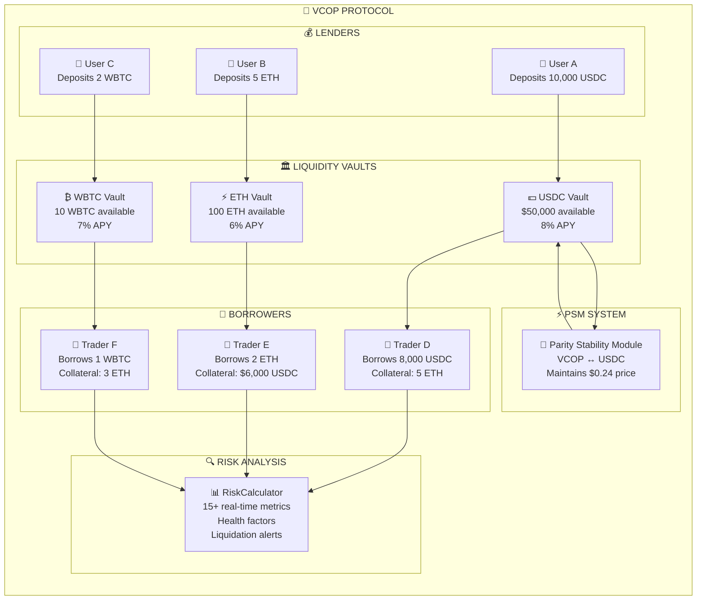

# 🔍 HOW THE PROTOCOL WORKS

## 🎯 **SIMPLE CONCEPT**

VCOP is like a "digital bank" that allows you to:
- **Lend money** using cryptocurrencies as collateral
- **Earn interest** by lending your money to others
- **Protect yourself** from Colombian peso devaluation
- **Speculate** on price movements

## 💰 **WAYS TO MAKE MONEY**

### **1. 🏦 LENDERS (Liquidity Providers)**
```
What do you do?: Deposit USDC, ETH or WBTC in the protocol
How do you earn?: Collect interest from borrowers

Example:
- Deposit 10,000 USDC
- Protocol lends it at 8% annual rate
- Earn ~800 USDC per year (passively)
```

### **2. 💸 TRADERS/SPECULATORS**
```
What do you do?: Use your crypto as collateral to borrow other cryptos
How do you earn?: Speculate on prices

Leverage Example:
- You have 1 ETH ($2,000)
- Use it as collateral to borrow $1,500 USDC
- Buy more ETH with those $1,500
- If ETH goes up 20%, you earn $300 extra (15% more profit!)

Protection against Devaluation Example:
- You have Colombian pesos (COP)
- Exchange them for VCOP (peso-pegged stablecoin)
- If peso devalues vs dollar, VCOP maintains its value
- Protect your money from inflation!
```

### **3. ⚡ LIQUIDATORS**
```
What do you do?: Monitor risky positions and liquidate them
How do you earn?: Collect bonuses for liquidating

Example:
- Someone borrowed $1,000 with $1,200 collateral
- Price drops and collateral is now worth only $1,100
- You liquidate the position
- Earn ~$50-100 bonus (5-10%)
```

### **4. 🚀 ARBITRAGEURS**
```
What do you do?: Take advantage of price differences between markets
How do you earn?: Buy cheap on one side, sell expensive on the other

Example:
- VCOP is worth $0.24 on the protocol
- VCOP is worth $0.25 on another exchange
- Buy VCOP on the protocol, sell on the exchange
- Earn $0.01 per VCOP (4% profit!)
```

## 💡 **SPECIAL OPPORTUNITIES**

### **📉 WHEN THE PESO DEVALUES**
```
Scenario: Colombian peso devalues 10% vs the dollar

For VCOP holders:
✅ VCOP maintains its value in dollars
✅ You have more purchasing power in Colombia
✅ You protect yourself from inflation

For smart traders:
✅ Can "short" the peso using VCOP
✅ Profit when the peso weakens
✅ Protect their wealth
```

### **💎 ADVANCED STRATEGIES**
```
1. "Carry Trade": 
   - Borrow VCOP at 5%
   - Invest in crypto that yields 15%
   - Net profit: 10%

2. "Portfolio Hedge":
   - You have peso investments
   - Buy VCOP as insurance
   - If peso drops, VCOP compensates

3. "Yield Farming":
   - Provide ETH-USDC liquidity
   - Earn trading fees + interest
   - 8-15% annual returns
```

## 🏢 **HOW THE PROTOCOL EARNS**

```
1. Transaction Fees: 0.1-0.5% per operation
2. Interest Spread: Difference between what it pays and charges
3. Liquidation Fees: Percentage of liquidations
4. PSM Fees: Commission on VCOP↔USDC swaps

Monthly example:
- $1M in loan volume
- 0.5% in fees = $5,000
- Operating expenses: ~$2,000  
- Net profit: $3,000/month
```

## 🛡️ **SECURITY AND PROTECTIONS**

```
For Lenders:
✅ Your money is over-collateralized (120-150%)
✅ Automatic liquidations protect your capital
✅ Audited and tested contracts

For Borrowers:
✅ You retain ownership of your collateral
✅ You can add more collateral if price drops
✅ You only pay interest on what you use

For the Protocol:
✅ Emergency reserves
✅ Automatic pause mechanisms
✅ Redundant price oracles
```

## 📊 **STEP-BY-STEP PRACTICAL EXAMPLES**

### **💼 Case 1: Conservative Lender**
```
Maria has $10,000 USDC and wants to generate passive income

Step 1: Deposits 10,000 USDC in the vault
Step 2: Protocol lends her money to traders
Step 3: Maria earns 8% annually = $800 USDC
Step 4: Can withdraw her money anytime

Risk: ⭐⭐☆☆☆ (Very low)
Return: 8% annually
```

### **💼 Case 2: Aggressive Trader**
```
Carlos has 2 ETH ($4,000) and thinks ETH will go up

Step 1: Deposits 2 ETH as collateral
Step 2: Borrows $3,000 USDC (75% LTV)
Step 3: Buys 1.5 more ETH with the $3,000
Step 4: Now has exposure to 3.5 ETH total

If ETH goes up 20%:
- His 3.5 ETH worth $4,800 ($800 more)
- Must repay $3,000 + interest ($3,060)
- Net profit: ~$740 (18.5% on initial capital)

Risk: ⭐⭐⭐⭐☆ (High)
Potential return: 15-25%
```

### **💼 Case 3: Protection against Devaluation**
```
Ana lives in Colombia and has 50M COP in savings

Problem: Peso might devalue
Solution: Convert to VCOP

Step 1: Exchanges 50M COP for $11,904 USDC (at 4,200 COP/USD)
Step 2: Exchanges USDC for 49,600 VCOP (at $0.24/VCOP)
Step 3: Peso devalues 15% → 1 USD = 4,830 COP

Result:
- Without VCOP: Her 50M COP now worth $10,352
- With VCOP: Her 49,600 VCOP worth $11,904
- Savings: $1,552 (15% protection)

Risk: ⭐⭐☆☆☆ (Low)
Benefit: Protection against inflation
```

### **💼 Case 4: Opportunistic Liquidator**
```
David is a bot/trader looking for liquidations

Search: Positions with ratio < 120%
Finds: Pedro has $1,000 borrowed with $1,100 collateral

Step 1: David pays Pedro's debt ($1,000)
Step 2: Receives Pedro's collateral ($1,100)
Step 3: Protocol bonus: $50
Step 4: Total profit: $150 (15%)

Frequency: 5-10 liquidations/month
Monthly profit: $500-2,000

Risk: ⭐⭐⭐☆☆ (Medium)
Return: 10-20% per liquidation
```

## 🎲 **YIELD CALCULATOR**

### **For Lenders:**
```
Initial capital: $X
Annual rate: 6-12% (depending on demand)
Time: Y months

Profit = (X × Rate × Y) / 12

Example: $10,000 × 8% × 6 months / 12 = $400
```

### **For Leveraged Traders:**
```
Capital: $X
Leverage: 2x (150% collateral)
Price movement: +Z%

Profit = X × 2 × Z% - Loan cost

Example: $5,000 × 2 × 25% - $100 = $2,400
```

### **For Liquidators:**
```
Liquidations/month: N
Average per liquidation: $Y
Average bonus: 8%

Income = N × Y × 8%

Example: 20 liquidations × $500 × 8% = $800/month
```

## 🎯 **PROTOCOL FLOW**



## 💰 **PASSIVE INCOME EXAMPLES**

### **🏦 CONSERVATIVE PORTFOLIO ($50,000)**
```
Distribution:
- 60% USDC ($30,000) → 8% APY = $2,400/year
- 30% ETH ($15,000) → 6% APY = $900/year  
- 10% WBTC ($5,000) → 7% APY = $350/year

Total annual income: $3,650 (7.3% portfolio return)
Monthly income: ~$304
Risk level: ⭐⭐☆☆☆
```

### **🚀 AGGRESSIVE PORTFOLIO ($50,000)**
```
Strategy: Leverage + Higher risk
- Deposit $50,000 as collateral
- Borrow $37,500 additional (75% LTV)
- Total exposure: $87,500

If portfolio rises 20%:
- Gain: $87,500 × 20% = $17,500
- Loan cost: $37,500 × 8% = $3,000
- Net profit: $14,500 (29% on initial capital)

Risk level: ⭐⭐⭐⭐☆
Potential return: 15-35%
```

## 🛡️ **RISK MANAGEMENT STRATEGIES**

### **🔄 DIVERSIFICATION**
```
Never put all capital in one asset:
- 40% Stablecoins (USDC, VCOP) - Low risk
- 30% ETH - Medium risk  
- 20% WBTC - Medium risk
- 10% Other alts - High risk
```

### **📊 POSITION MONITORING**
```
Key metrics to watch:
- Health Factor > 150% (safe zone)
- Collateralization ratio > 130%
- Time to liquidation > 30 days
- Portfolio correlation < 70%
```

### **🚨 EMERGENCY PROCEDURES**
```
If health factor drops below 130%:
1. Add more collateral immediately
2. Partially repay loan
3. Close risky positions
4. Rebalance portfolio
```

## 💎 **ADVANCED TRADING STRATEGIES**

### **🔄 DELTA NEUTRAL STRATEGY**
```
Goal: Earn yield without price exposure

Example:
- Deposit 10 ETH as collateral
- Borrow $15,000 USDC (75% LTV)
- Sell $15,000 USDC for 7.5 ETH
- Total position: 17.5 ETH long, 7.5 ETH short
- Net exposure: 10 ETH (original position)
- Earn lending yield without price risk
```

### **📈 MOMENTUM TRADING**
```
Goal: Amplify gains during bull markets

Example:
- ETH trending upward strongly
- Deposit 5 ETH ($10,000)
- Borrow $7,500 USDC max leverage
- Buy 3.75 more ETH
- Total exposure: 8.75 ETH
- If ETH +30%: Profit = $8,750 × 30% - loan cost = ~$2,125
```

### **🛡️ HEDGING STRATEGY**
```
Goal: Protect large crypto holdings

Example:
- Hold 50 ETH portfolio ($100,000)
- Worried about market crash
- Deposit 20 ETH as collateral
- Borrow $30,000 USDC
- If ETH crashes 40%:
  * Portfolio loss: $40,000
  * USDC value: $30,000 gained vs ETH
  * Net loss reduced by $30,000
```

## 🌟 **UNIQUE PROTOCOL ADVANTAGES**

### **🇨🇴 COP STABLECOIN BENEFITS**
```
Only protocol offering:
✅ Colombian peso exposure in DeFi
✅ Protection against COP devaluation  
✅ Arbitrage opportunities with local markets
✅ Cross-border payments facilitation
✅ Remittance cost reduction
```

### **🔧 ULTRA-FLEXIBLE SYSTEM**
```
Unlike Aave/Compound:
✅ No hardcoded LTV limits
✅ User-controlled risk levels
✅ Multiple loan managers
✅ Custom asset handlers
✅ Advanced risk calculations
```

### **📊 SUPERIOR RISK ANALYSIS**
```
15+ real-time metrics:
✅ Health factor projections
✅ Liquidation price calculations
✅ Time-to-liquidation estimates
✅ Portfolio correlation analysis
✅ Price impact simulations
✅ Maximum safe withdrawal amounts
✅ Optimal rebalancing suggestions
```

## 🎯 **SUCCESS METRICS**

### **MONTHLY TARGETS**
```
Conservative users:
- 6-8% annual yield
- <2% drawdown risk
- >95% position safety

Aggressive users:
- 15-25% annual returns
- <20% drawdown risk
- Active position management

Protocol metrics:
- >$10M TVL target
- <1% liquidation rate
- 99.9% uptime
```

## 🔮 **FUTURE ROADMAP**

### **Q1 2025**
```
✅ Additional asset support (ARB, OP, MATIC)
✅ Advanced liquidation algorithms
✅ Mobile app interface
✅ Cross-chain bridge integration
```

### **Q2 2025**
```
🔄 Governance token launch
🔄 DAO transition
🔄 Additional stablecoins (EUR, JPY)
🔄 Institutional lending features
```

---

*Ready to start earning? Check our [Operating System Guide](GUIA_SISTEMA_OPERATIVO.md) for step-by-step instructions!* 