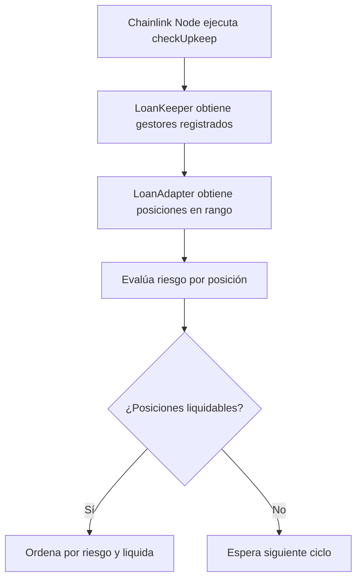
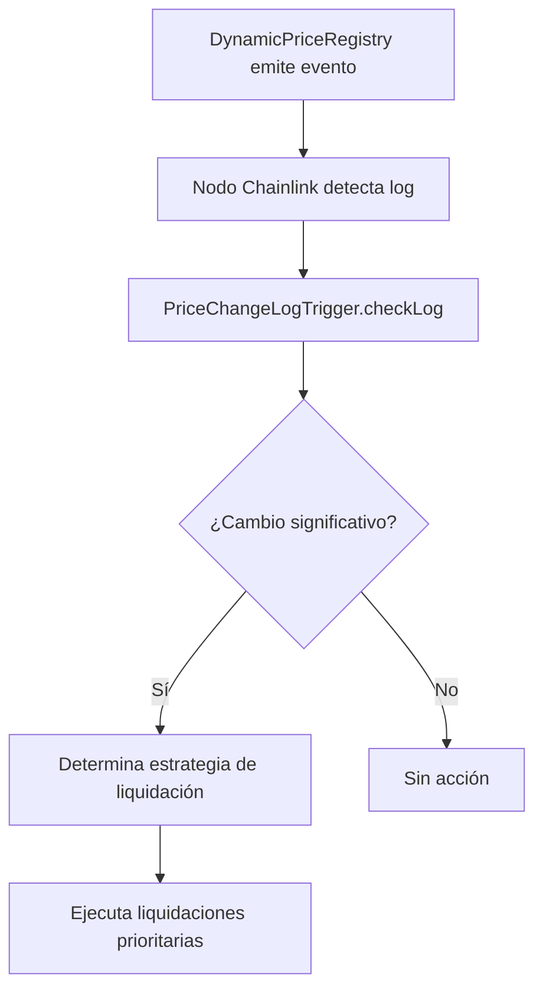

# 🤖 Sistema de Automatización Avanzada con Chainlink

## 🚀 Descripción General

Sistema completo de automatización usando **Chainlink Automation v2.25.0** con soporte para `FlexibleLoanManager`, `DynamicPriceRegistry` y liquidaciones automatizadas inteligentes. El sistema implementa tanto **Custom Logic Automation** como **Log Trigger Automation** para máxima eficiencia.

## 🏗️ Arquitectura del Sistema

### Componentes Principales

### 1. **LoanAutomationKeeperOptimized** ⚡ 
**Función**: Keeper Principal (Custom Logic Automation)
- **Ubicación**: `src/automation/core/LoanAutomationKeeperOptimized.sol`
- **Propósito**: Ejecuta liquidaciones basadas en lógica personalizada
- **Características**:
  - Extiende `AutomationCompatible` (detección automática en UI)
  - Registro interno de gestores de préstamos con prioridades
  - Procesamiento en lotes optimizado para gas
  - Priorización por nivel de riesgo
  - Cooldown entre liquidaciones
  - Métricas de rendimiento integradas

### 2. **LoanManagerAutomationAdapter** 🔗
**Función**: Adaptador para FlexibleLoanManager
- **Ubicación**: `src/automation/core/LoanManagerAutomationAdapter.sol`
- **Propósito**: Interfaz entre automatización y protocolo de préstamos
- **Características**:
  - Implementa la interfaz `ILoanAutomation`
  - Seguimiento eficiente de posiciones activas
  - Evaluación dinámica de riesgo
  - Integración directa con `FlexibleLoanManager`

### 3. **PriceChangeLogTrigger** 📈
**Función**: Trigger basado en eventos de precio (Log Automation)
- **Ubicación**: `src/automation/core/PriceChangeLogTrigger.sol`
- **Propósito**: Respuesta inmediata a cambios de precio
- **Características**:
  - Usa la interfaz oficial `ILogAutomation` de Chainlink
  - Registro interno de gestores de préstamos con prioridades
  - Detección de volatilidad en tiempo real
  - Múltiples niveles de urgencia (4 niveles)
  - Modo de volatilidad temporal
  - Integración directa con `DynamicPriceRegistry`

## 🔄 Flujo de Trabajo Detallado

### Análisis Técnico del Sistema

El sistema de automatización implementa dos tipos de triggers de Chainlink v2.25.0:

1. **Custom Logic Automation**: Ejecución cíclica programada para verificar posiciones
2. **Log Trigger Automation**: Ejecución reactiva basada en eventos de precio

#### Arquitectura del Sistema Actual

El sistema actual funciona de la siguiente manera:

- **LoanAutomationKeeperOptimized**: Maneja su propio registro de gestores de préstamos con `registeredManagers` y `managersList`
- **PriceChangeLogTrigger**: Mantiene su propia lista de gestores de préstamos con `registeredLoanManagers` y `loanManagersList`  
- **LoanManagerAutomationAdapter**: Implementa `ILoanAutomation` y se conecta directamente con `FlexibleLoanManager`
- **Interfaces Oficiales**: Usa `AutomationCompatible` e `ILogAutomation` de Chainlink v2.25.0

### Ciclo de Custom Logic Automation



### Ciclo de Log Trigger Automation



### Detalles de Implementación Técnica

#### 1. **LoanAutomationKeeperOptimized** - Análisis de Código

```solidity
// 📍 src/automation/core/LoanAutomationKeeperOptimized.sol
contract LoanAutomationKeeperOptimized is AutomationCompatible, Ownable {
    
    // ✅ Extiende AutomationCompatible (no solo interfaz) para detección automática en UI
    // ✅ Registro interno de gestores de préstamos con sistema de prioridades
    // ✅ Implementa lógica de batching optimizada para gas
    // ✅ Sistema de priorización basado en riesgo
```

**Características Clave**:
- **Batching Inteligente**: Procesa hasta 200 posiciones por ejecución
- **Ordenamiento por Riesgo**: Prioriza posiciones con mayor riesgo
- **Optimización de Gas**: Reserva gas para completar y previene out-of-gas
- **Sistema de Cooldown**: Previene spam de liquidaciones
- **Métricas en Tiempo Real**: Seguimiento de rendimiento y estadísticas

#### 2. **PriceChangeLogTrigger** - Respuesta a Eventos

```solidity
// 📍 src/automation/core/PriceChangeLogTrigger.sol  
contract PriceChangeLogTrigger is ILogAutomation, Ownable {
    
    // ✅ Usa la interfaz oficial ILogAutomation v2.25.0
    // ✅ Detección de volatilidad multi-nivel
    // ✅ Modo de volatilidad temporal (1 hora por defecto)
    // ✅ Estrategias dinámicas de liquidación
```

**Características Técnicas**:
- **Umbrales Multi-tier**: 4 niveles de urgencia (5%, 7.5%, 10%, 15%)
- **Modo Volatilidad**: Activación automática con parámetros ajustables
- **Decodificación de Precios**: Soporte para múltiples formatos de eventos
- **Filtrado de Activos**: Liquidación selectiva por activo afectado

#### 3. **LoanManagerAutomationAdapter** - Interfaz Inteligente

```solidity
// 📍 src/automation/core/LoanManagerAutomationAdapter.sol
contract LoanManagerAutomationAdapter is ILoanAutomation, Ownable {
    
    // ✅ Implementa la interfaz completa ILoanAutomation
    // ✅ Seguimiento eficiente de posiciones activas  
    // ✅ Integración directa con FlexibleLoanManager
    // ✅ Sistema dinámico de evaluación de riesgo
```

**Características Avanzadas**:
- **Seguimiento de Posiciones**: Array optimizado para iteración eficiente
- **Evaluación de Riesgo**: Calcula riesgo basado en `canLiquidate()` y ratio de colateralización
- **Auto-sincronización**: Limpieza automática de posiciones cerradas
- **Métricas de Rendimiento**: Tasa de éxito y estadísticas de liquidación

#### 4. **Flujo de Datos en Tiempo Real**

```mermaid
flowchart TB
    subgraph Price ["📈 Flujo de Actualización de Precios"]
        A[DynamicPriceRegistry emite evento] 
        B[Nodo Chainlink detecta log]
        C[PriceChangeLogTrigger.checkLog]
        D{¿Cambio significativo?}
        E[Determina estrategia de liquidación]
        F[Ejecuta liquidaciones prioritarias]
        M[Sin acción]
        
        A --> B --> C --> D
        D -->|Sí| E --> F
        D -->|No| M
    end
    
    subgraph Logic ["🔄 Flujo de Lógica Personalizada"]
        G[Nodo Chainlink ejecuta checkUpkeep]
        H[LoanKeeper obtiene gestores registrados]
        I[LoanAdapter obtiene posiciones en rango]
        J[Evalúa riesgo por posición]
        K{¿Posiciones liquidables?}
        L[Ordena por riesgo y liquida]
        N[Espera siguiente ciclo]
        
        G --> H --> I --> J --> K
        K -->|Sí| L
        K -->|No| N
    end
```



## ⚙️ Configuración del Sistema

### Variables de Entorno

```bash
# Contratos requeridos
FLEXIBLE_LOAN_MANAGER=0x...        # Dirección de FlexibleLoanManager
DYNAMIC_PRICE_REGISTRY=0x...       # Dirección de DynamicPriceRegistry
PRIVATE_KEY=0x...                  # Clave privada del deployer

# Configuración de automatización
MAX_GAS_PER_UPKEEP=2500000        # Gas máximo por upkeep
MIN_RISK_THRESHOLD=75             # Umbral mínimo de riesgo (%)
LIQUIDATION_COOLDOWN=180          # Cooldown entre liquidaciones (segundos)
ENABLE_VOLATILITY_MODE=true       # Habilitar detección de volatilidad
```

### Umbrales de Riesgo Multi-Nivel

El sistema usa evaluación de riesgo por niveles:

| Nivel | Rango | Color | Acción | Prioridad |
|-------|-------|-------|--------|-----------|
| **🔴 Crítico** | 95%+ | Rojo | Liquidación inmediata | Máxima |
| **🟠 Inmediato** | 85-94% | Naranja | Liquidación alta prioridad | Alta |
| **🟡 Urgente** | 75-84% | Amarillo | Liquidación estándar | Media |
| **🟢 Advertencia** | 60-74% | Verde | Solo monitoreo | Baja |
| **⚪ Seguro** | <60% | Blanco | Sin acción | - |

### Detección de Volatilidad

```solidity
// Umbrales de cambio de precio (base 1,000,000)
priceChangeThreshold = 50000    // 5% - Activación básica
urgentThreshold = 75000         // 7.5% - Nivel urgente  
immediateThreshold = 100000     // 10% - Nivel inmediato
criticalThreshold = 150000      // 15% - Nivel crítico
volatilityBoostThreshold = 100000 // 10% - Modo volatilidad
```

## 🚀 Despliegue Paso a Paso

### 1. Configuración del Entorno

```bash
# Clonar y configurar
git clone <repo>
cd Vcop-Collateral-system-hook-main

# Configurar variables de entorno
cp .env.example .env
# Editar .env con tus valores

# Configurar direcciones de contratos desplegados
export FLEXIBLE_LOAN_MANAGER=0x...
export DYNAMIC_PRICE_REGISTRY=0x...
```

### 2. Desplegar Sistema de Automatización

```bash
# Opción A: Despliegue limpio completo
forge script script/automation/DeployAutomationClean.s.sol \
    --broadcast \
    --verify \
    --rpc-url $RPC_URL

# Opción B: Despliegue estándar
forge script script/automation/DeployAutomation.s.sol \
    --broadcast \
    --verify \
    --rpc-url $RPC_URL
```

### 3. Configurar en UI de Chainlink Automation

#### Custom Logic Upkeep
```bash
# Obtener checkData para registro
cast call $LOAN_AUTOMATION_KEEPER \
    "generateCheckData(address,uint256,uint256)" \
    $LOAN_ADAPTER_ADDRESS 0 25

# Configuración en UI:
# - Dirección del Contrato: $LOAN_AUTOMATION_KEEPER  
# - checkData: <resultado del comando anterior>
# - Límite de Gas: 2,500,000
# - Fondos: Mínimo 10 LINK
```

#### Log Trigger Upkeep
```bash
# Configuración en UI:
# - Dirección del Contrato: $PRICE_CHANGE_LOG_TRIGGER
# - Filtro de Log: 
#   - Dirección: $DYNAMIC_PRICE_REGISTRY
#   - Topic0: Firma del evento TokenPriceUpdated
# - Límite de Gas: 2,000,000  
# - Fondos: Mínimo 5 LINK
```

## 🔧 Funciones de Configuración

### LoanAutomationKeeperOptimized

```solidity
// Configurar umbrales
loanKeeper.setMinRiskThreshold(75);
loanKeeper.setMaxPositionsPerBatch(25);
loanKeeper.setLiquidationCooldown(180);

// Registrar gestores con prioridad
loanKeeper.registerLoanManager(adapterAddress, 100);

// Control de emergencia
loanKeeper.setEmergencyPause(false);
```

### LoanManagerAutomationAdapter

```solidity
// Configurar umbrales dinámicos
loanAdapter.setRiskThresholds(
    95,  // Umbral crítico
    85,  // Umbral de peligro
    75   // Umbral de advertencia  
);

// Configurar cooldown
loanAdapter.setLiquidationCooldown(180);

// Conectar a automatización
loanAdapter.setAutomationContract(loanKeeperAddress);

// Inicializar seguimiento de posiciones
uint256[] memory existingPositions = getExistingPositions();
loanAdapter.initializePositionTracking(existingPositions);
```

### PriceChangeLogTrigger

```solidity
// Configurar umbrales de precio
priceLogTrigger.setPriceChangeThresholds(
    50000,   // 5% básico
    75000,   // 7.5% urgente
    100000,  // 10% inmediato
    150000   // 15% crítico
);

// Configurar volatilidad
priceLogTrigger.setVolatilityParameters(
    100000, // 10% umbral de volatilidad
    3600    // 1 hora de duración
);

// Registrar gestores
priceLogTrigger.registerLoanManager(adapterAddress, 100);
```

## 📊 Monitoreo y Análisis

### Estadísticas del Sistema

```solidity
// Rendimiento del keeper
(uint256 totalLiquidations, 
 uint256 totalUpkeeps, 
 uint256 lastExecution,
 uint256 averageGas,
 uint256 managersCount) = loanKeeper.getStats();

// Estadísticas del adaptador
(uint256 tracked,
 uint256 atRisk, 
 uint256 liquidatable,
 uint256 critical,
 uint256 performance) = loanAdapter.getTrackingStats();

// Estadísticas de precio
(uint256 triggers,
 uint256 liquidations,
 uint256 volatilityEvents, 
 uint256 lastTrigger,
 uint256 activeVolatile) = priceLogTrigger.getStatistics();
```

### Monitoreo de Posiciones en Tiempo Real

```solidity
// Obtener todas las posiciones en riesgo
(uint256[] memory riskPositions, 
 uint256[] memory riskLevels) = loanAdapter.getPositionsAtRisk();

// Verificar posición específica
(bool isAtRisk, uint256 riskLevel) = 
    loanAdapter.isPositionAtRisk(positionId);

// Obtener datos de salud de posición
(address borrower,
 uint256 collateralValue,
 uint256 debtValue, 
 uint256 healthFactor) = loanAdapter.getPositionHealthData(positionId);
```

## 🚨 Procedimientos de Emergencia

### Pausa de Emergencia

```solidity
// Pausar todo el sistema
loanKeeper.setEmergencyPause(true);
priceLogTrigger.setEmergencyPause(true);

// Reanudar después de solucionar problemas
loanKeeper.setEmergencyPause(false);
priceLogTrigger.setEmergencyPause(false);
```

### Liquidación Manual

```solidity
// Si falla la automatización, liquidar manualmente
flexibleLoanManager.liquidatePosition(positionId);

// O a través del adaptador
loanAdapter.automatedLiquidation(positionId);
```

## 🎯 Mejores Prácticas

### Optimización de Gas

- **Tamaño de Lote**: Comenzar con 25 posiciones, ajustar según uso de gas
- **Umbrales de Riesgo**: Usar 75% mínimo para balance seguridad/eficiencia
- **Cooldown**: Mínimo 3 minutos para prevenir spam
- **Límites de Gas**: 2.5M para lógica personalizada, 2M para triggers de log

### Gestión de Riesgo

- **Monitoreo Activo**: Revisar métricas diariamente
- **Alertas**: Configurar notificaciones para fallos
- **Respaldo**: Mantener procedimientos de liquidación manual
- **Pruebas**: Probar con posiciones de muestra regularmente

## 📈 Especificaciones Técnicas

### Versiones de Chainlink
- **AutomationCompatible**: v2.25.0
- **ILogAutomation**: v2.25.0  
- **Interfaces**: Chainlink Oficial

### Compatibilidad
- **Solidity**: ^0.8.24 - ^0.8.26
- **FlexibleLoanManager**: ✅ Completamente integrado
- **DynamicPriceRegistry**: ✅ Soporte nativo
- **Multi-Asset**: ✅ Soporte completo

### Límites del Sistema
- **Tamaño Máximo de Lote**: 200 posiciones
- **Gas Máximo por Upkeep**: 5,000,000
- **Cooldown Mínimo**: 60 segundos
- **Gestores Máximos**: Ilimitado (permitiendo gas)

## 🎯 Resumen Ejecutivo del Sistema Actual

### Características Principales Implementadas

✅ **Chainlink Automation v2.25.0** - Versión más reciente con `AutomationCompatible` e `ILogAutomation`  
✅ **Sistema de Doble Trigger** - Custom Logic + Log Triggers para cobertura completa  
✅ **Integración FlexibleLoanManager** - Integración nativa con liquidaciones optimizadas  
✅ **Monitoreo Dinámico de Precios** - Respuesta inmediata a cambios de `DynamicPriceRegistry`  
✅ **Evaluación de Riesgo Multi-tier** - 4 niveles de urgencia con estrategias diferenciadas  
✅ **Detección de Volatilidad** - Modo especial para alta volatilidad del mercado  
✅ **Optimización de Gas** - Batching inteligente y gestión eficiente de gas  
✅ **Seguimiento de Posiciones** - Sistema automático de seguimiento para posiciones activas  
✅ **Métricas de Rendimiento** - Estadísticas completas y monitoreo en tiempo real  
✅ **Controles de Emergencia** - Pausas de emergencia y procedimientos de respaldo  

### Ventajas Técnicas del Sistema

🚀 **Escalabilidad**: Soporte para múltiples gestores de préstamos simultáneos  
🛡️ **Seguridad**: Cooldowns, patrones de autorización y controles de emergencia  
⚡ **Eficiencia**: Optimizado para gas con batching y priorización inteligente  
🎯 **Precisión**: Evaluación de riesgo basada en datos reales del protocolo  
🔄 **Flexibilidad**: Parámetros configurables adaptables a condiciones del mercado  
📊 **Observabilidad**: Métricas detalladas y funciones de debugging  

## 🔗 Recursos Adicionales

- [Documentación de Chainlink Automation](https://docs.chain.link/chainlink-automation)
- [Guía de FlexibleLoanManager](../../../src/core/README.md)
- [Documentación de DynamicPriceRegistry](../../../src/interfaces/IPriceRegistry.sol)
- [Interfaz ILoanAutomation](../../../src/automation/interfaces/ILoanAutomation.sol)

---

*Sistema diseñado para máxima eficiencia, seguridad y flexibilidad en el manejo automatizado de liquidaciones para el protocolo de préstamos.* 