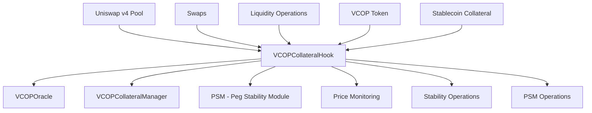

# 🔗 Uniswap v4 Hook - VCOPCollateralHook

## 📋 Introduction

The **VCOPCollateralHook** is a custom Uniswap v4 hook that acts as the main price stabilization mechanism for the VCOP token. This hook continuously monitors the token price and executes automated operations to maintain parity with the Colombian peso (COP).

## 🏗️ General Architecture



## 🔧 Main Components

### 1. BaseHook Integration
The hook extends `BaseHook` from Uniswap v4 and implements the following interception points:
- `beforeSwap`: Intercepts swaps before execution
- `afterSwap`: Processes post-swap actions
- `afterAddLiquidity`: Monitors liquidity changes

### 2. Price Oracle Integration
```solidity
VCOPOracle public immutable oracle;
```
Integrates with a custom oracle to obtain:
- VCOP/COP rate
- USD/COP rate
- Real-time price data

### 3. PSM (Peg Stability Module)
Stabilization system that allows:
- VCOP to collateral exchange at rates near parity
- Collateral to VCOP exchange
- Automatic stabilization operations

## ⚙️ Key Features

### 🎯 Price Monitoring
```solidity
function monitorPrice() public returns (bool) {
    uint256 vcopToCopRate = oracle.getVcopToCopRate();
    bool withinBounds = (vcopToCopRate >= pegLowerBound && vcopToCopRate <= pegUpperBound);
    emit PriceMonitored(vcopToCopRate, withinBounds);
    return withinBounds;
}
```

**Stability Parameters:**
- `pegUpperBound`: 1.01 COP (101% of parity)
- `pegLowerBound`: 0.99 COP (99% of parity)
- 0.1% tolerance to maintain stability

### 🔄 Hook Lifecycle

#### Before Swap
```solidity
function _beforeSwap(
    address sender,
    PoolKey calldata key,
    SwapParams calldata params,
    bytes calldata hookData
) internal override returns (bytes4, BeforeSwapDelta, uint24)
```

**Functions:**
1. Detects if the pool contains VCOP
2. Identifies large swaps that could destabilize the price
3. Executes preventive stabilization if necessary

#### After Swap
```solidity
function _afterSwap(
    address sender,
    PoolKey calldata key,
    SwapParams calldata params,
    BalanceDelta delta,
    bytes calldata
) internal override returns (bytes4, int128)
```

**Functions:**
1. Monitors post-swap price
2. Executes stabilization operations if price goes out of bounds
3. Records events for analysis

### 💱 PSM Operations

#### Swap VCOP for Collateral
```solidity
function psmSwapVCOPForCollateral(uint256 vcopAmount) external {
    // Validations
    require(!psmPaused, "PSM is paused");
    require(vcopAmount <= psmMaxSwapAmount, "Amount exceeds PSM limit");
    
    // Collateral calculation
    uint256 collateralAmount = calculateCollateralForVCOP(vcopAmount);
    uint256 fee = (collateralAmount * psmFee) / 1000000;
    uint256 amountOut = collateralAmount - fee;
    
    // Burn VCOP and transfer collateral
    VCOPCollateralized(Currency.unwrap(vcopCurrency)).burn(address(this), vcopAmount);
    collateralManager().transferPSMCollateral(msg.sender, collateralTokenAddress, amountOut);
}
```

#### Swap Collateral for VCOP
```solidity
function psmSwapCollateralForVCOP(uint256 collateralAmount) external {
    // Validations and calculations
    uint256 vcopAmount = calculateVCOPForCollateral(collateralAmount);
    
    // Transfer collateral and mint VCOP
    IERC20(collateralTokenAddress).safeTransferFrom(msg.sender, addr), vcopAmount);
    collateralManager().transferPSMCollateral(msg.sender, collateralTokenAddress, amountOut);
}
```

#### Swap Collateral for VCOP
```solidity
function psmSwapCollateralForVCOP(uint256 collateralAmount) external {
    // Validations and calculations
    uint256 vcopAmount = calculateVCOPForCollateral(collateralAmount);
    
    // Transfer collateral and mint VCOP
    IERC20(collateralTokenAddress).safeTransferFrom(msg.sender, address(collateralManager()), collateralAmount);
    collateralManager().mintPSMVcop(msg.sender, collateralTokenAddress, amountOut);
}
```

## 📈 Metrics and Monitoring

### Main Events
```solidity
event PriceMonitored(uint256 vcopToCopRate, bool isWithinBounds);
event PSMSwap(address account, bool isVcopToCollateral, uint256 amountIn, uint256 amountOut);
event PSMStabilizationExecuted(bool isBuy, uint256 amount, uint256 price);
```

### PSM Statistics
```solidity
function getPSMStats() external view returns (
    uint256 vcopReserve,
    uint256 collateralReserve,
    uint256 lastOperationTimestamp,
    uint256 totalSwapsCount
)
```

## 🚨 Risk Management

### Operational Limits
1. **PSM Swap Limit**: Maximum 10,000 VCOP per operation
2. **Large Swap Threshold**: 5,000 VCOP
3. **Price Tolerance**: ±1% from parity

### Security Mechanisms
1. **Emergency Pauses**: PSM can be paused
2. **Reserve Validation**: Verification before each operation
3. **Slippage Limits**: Protection against price manipulation

## 💡 Use Cases

### Case 1: Large Swap Detected
```
1. User attempts 6,000 VCOP swap → Hook detects large swap
2. Hook executes stabilizePriceWithPSM() preventively
3. Swap proceeds with stabilized price
4. Hook monitors post-swap price
```

### Case 2: Price Out of Bounds
```
1. VCOP price = 0.98 COP (below limit)
2. Hook executes automatic VCOP purchase
3. Price stabilizes near 1.00 COP
4. System records stabilization operation
```

## 🔗 Ecosystem Integration

### Main Connections
- **VCOPCollateralManager**: Collateral management and PSM reserves
- **VCOPOracle**: Real-time price data
- **VCOPCollateralized**: VCOP token for mint/burn
- **Uniswap v4 Pool**: Main liquidity pool

### Data Flow
```
Oracle → Hook → Decision → PSM → CollateralManager → VCOP Token
```

## 🔧 Implementation Considerations

### Gas Optimization
- Use of `view` functions for calculations
- Batch operations when possible
- Lazy loading of oracle data

### Upgradability
- Hook is immutable once deployed
- Admin-configurable parameters
- Modular integration with other components

### Testing
- Unit tests for each hook function
- Integration tests with Uniswap v4 pools
- Simulation tests for market scenarios

## 📚 References

- [Uniswap v4 Hook Documentation](https://docs.uniswap.org/contracts/v4/overview)
- [VCOP Architecture](NUEVA_ARQUITECTURA.md)
- [PSM Documentation](../deployment/PSM-README.md) 