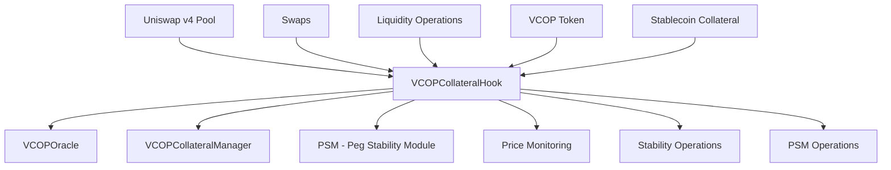

# 🔗 Uniswap v4 Hook - VCOPCollateralHook

## 📋 Introducción

El **VCOPCollateralHook** es un hook personalizado de Uniswap v4 que actúa como el mecanismo principal de estabilización de precios para el token VCOP. Este hook monitora continuamente el precio del token y ejecuta operaciones automatizadas para mantener la paridad con el peso colombiano (COP).

## 🏗️ Arquitectura General



## 🔧 Componentes Principales

### 1. BaseHook Integration
El hook extiende `BaseHook` de Uniswap v4 y implementa los siguientes puntos de interceptación:
- `beforeSwap`: Intercepta swaps antes de la ejecución
- `afterSwap`: Procesa acciones post-swap
- `afterAddLiquidity`: Monitorea cambios de liquidez

### 2. Price Oracle Integration
```solidity
VCOPOracle public immutable oracle;
```
Se integra con un oráculo personalizado para obtener:
- Tasa VCOP/COP
- Tasa USD/COP
- Datos de precios en tiempo real

### 3. PSM (Peg Stability Module)
Sistema de estabilización que permite:
- Intercambio de VCOP por colateral a tasas cerca de la paridad
- Intercambio de colateral por VCOP
- Operaciones automáticas de estabilización

## ⚙️ Funcionalidades Clave

### 🎯 Monitoreo de Precios
```solidity
function monitorPrice() public returns (bool) {
    uint256 vcopToCopRate = oracle.getVcopToCopRate();
    bool withinBounds = (vcopToCopRate >= pegLowerBound && vcopToCopRate <= pegUpperBound);
    emit PriceMonitored(vcopToCopRate, withinBounds);
    return withinBounds;
}
```

**Parámetros de Estabilidad:**
- `pegUpperBound`: 1.01 COP (101% de la paridad)
- `pegLowerBound`: 0.99 COP (99% de la paridad)
- Tolerancia del 0.1% para mantener estabilidad

### 🔄 Hook Lifecycle

#### Before Swap
```solidity
function _beforeSwap(
    address sender,
    PoolKey calldata key,
    SwapParams calldata params,
    bytes calldata hookData
) internal override returns (bytes4, BeforeSwapDelta, uint24)
```

**Funciones:**
1. Detecta si el pool contiene VCOP
2. Identifica swaps grandes que podrían desestabilizar el precio
3. Ejecuta estabilización preventiva si es necesario

#### After Swap
```solidity
function _afterSwap(
    address sender,
    PoolKey calldata key,
    SwapParams calldata params,
    BalanceDelta delta,
    bytes calldata
) internal override returns (bytes4, int128)
```

**Funciones:**
1. Monitorea el precio post-swap
2. Ejecuta operaciones de estabilización si el precio sale de los límites
3. Registra eventos para análisis

### 💱 PSM Operations

#### Swap VCOP por Colateral
```solidity
function psmSwapVCOPForCollateral(uint256 vcopAmount) external {
    // Validaciones
    require(!psmPaused, "PSM is paused");
    require(vcopAmount <= psmMaxSwapAmount, "Amount exceeds PSM limit");
    
    // Cálculo de colateral
    uint256 collateralAmount = calculateCollateralForVCOP(vcopAmount);
    uint256 fee = (collateralAmount * psmFee) / 1000000;
    uint256 amountOut = collateralAmount - fee;
    
    // Quemar VCOP y transferir colateral
    VCOPCollateralized(Currency.unwrap(vcopCurrency)).burn(address(this), vcopAmount);
    collateralManager().transferPSMCollateral(msg.sender, collateralTokenAddress, amountOut);
}
```

#### Swap Colateral por VCOP
```solidity
function psmSwapCollateralForVCOP(uint256 collateralAmount) external {
    // Validaciones y cálculos
    uint256 vcopAmount = calculateVCOPForCollateral(collateralAmount);
    
    // Transferir colateral y mintear VCOP
    IERC20(collateralTokenAddress).safeTransferFrom(msg.sender, address(collateralManager()), collateralAmount);
    collateralManager().mintPSMVcop(msg.sender, collateralTokenAddress, amountOut);
}
```

### 🎛️ Estabilización Automática

```solidity
function stabilizePriceWithPSM() public {
    uint256 vcopToCopRate = oracle.getVcopToCopRate();
    
    if (vcopToCopRate < pegLowerBound) {
        // Precio bajo - comprar VCOP con colateral
        uint256 stabilizationAmount = calculateStabilizationAmount();
        _executePSMBuy(stabilizationAmount);
    } else if (vcopToCopRate > pegUpperBound) {
        // Precio alto - vender VCOP por colateral
        uint256 stabilizationAmount = calculateStabilizationAmount();
        _executePSMSell(stabilizationAmount);
    }
}
```

## 📊 Parámetros de Configuración

### Parámetros de Estabilidad
```solidity
uint256 public pegUpperBound = 1010000;    // 1.01 * 1e6
uint256 public pegLowerBound = 990000;     // 0.99 * 1e6
uint256 public largeSwapThreshold = 5000 * 1e6; // 5,000 VCOP
```

### Parámetros PSM
```solidity
uint256 public psmFee = 1000;              // 0.1% (1e6 basis)
uint256 public psmMaxSwapAmount = 10000 * 1e6; // 10,000 VCOP
bool public psmPaused = false;
```

## 🔐 Control de Acceso

### Funciones de Administración
- `pausePSM()`: Pausa/despausa el PSM
- `updateStabilityParameters()`: Actualiza límites de estabilidad
- `updatePSMParameters()`: Modifica parámetros del PSM
- `setCollateralManager()`: Configura el gestor de colateral

### Autorización
```solidity
require(msg.sender == collateralManager().owner(), "Not authorized");
```

## 📈 Métricas y Monitoreo

### Eventos Principales
```solidity
event PriceMonitored(uint256 vcopToCopRate, bool isWithinBounds);
event PSMSwap(address account, bool isVcopToCollateral, uint256 amountIn, uint256 amountOut);
event PSMStabilizationExecuted(bool isBuy, uint256 amount, uint256 price);
```

### Estadísticas PSM
```solidity
function getPSMStats() external view returns (
    uint256 vcopReserve,
    uint256 collateralReserve,
    uint256 lastOperationTimestamp,
    uint256 totalSwapsCount
)
```

## 🚨 Gestión de Riesgos

### Límites Operacionales
1. **Límite de Swap PSM**: Máximo 10,000 VCOP por operación
2. **Threshold de Swap Grande**: 5,000 VCOP
3. **Tolerancia de Precio**: ±1% de la paridad

### Mecanismos de Seguridad
1. **Pausas de Emergencia**: PSM puede ser pausado
2. **Validación de Reservas**: Verificación antes de cada operación
3. **Límites de Slippage**: Protección contra manipulación de precios

## 💡 Casos de Uso

### Caso 1: Swap Grande Detectado
```
1. Usuario intenta swap de 6,000 VCOP → Hook detecta swap grande
2. Hook ejecuta stabilizePriceWithPSM() preventivamente
3. Swap procede con precio estabilizado
4. Hook monitorea precio post-swap
```

### Caso 2: Precio Fuera de Límites
```
1. Precio VCOP = 0.98 COP (por debajo del límite)
2. Hook ejecuta compra automática de VCOP
3. Precio se estabiliza cerca de 1.00 COP
4. Sistema registra operación de estabilización
```

## 🔗 Integración con Ecosystem

### Conexiones Principales
- **VCOPCollateralManager**: Gestión de colateral y reservas PSM
- **VCOPOracle**: Datos de precios en tiempo real
- **VCOPCollateralized**: Token VCOP para mint/burn
- **Uniswap v4 Pool**: Pool principal de liquidez

### Flujo de Datos
```
Oracle → Hook → Decisión → PSM → CollateralManager → VCOP Token
```

## 🔧 Consideraciones de Implementación

### Gas Optimization
- Uso de `view` functions para cálculos
- Batch operations cuando es posible
- Lazy loading de datos del oráculo

### Upgradability
- Hook es inmutable una vez desplegado
- Parámetros configurables por admin
- Integración modular con otros componentes

### Testing
- Unit tests para cada función del hook
- Integration tests con pools de Uniswap v4
- Simulation tests para escenarios de mercado

## 📚 Referencias

- [Uniswap v4 Hook Documentation](https://docs.uniswap.org/contracts/v4/overview)
- [VCOP Architecture](NUEVA_ARQUITECTURA.md)
- [PSM Documentation](../deployment/PSM-README.md) 