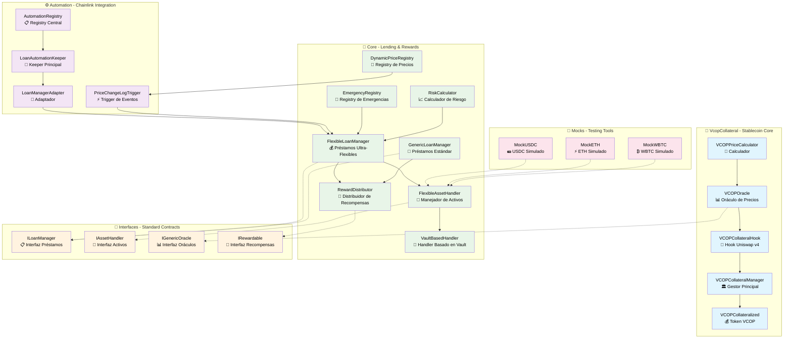
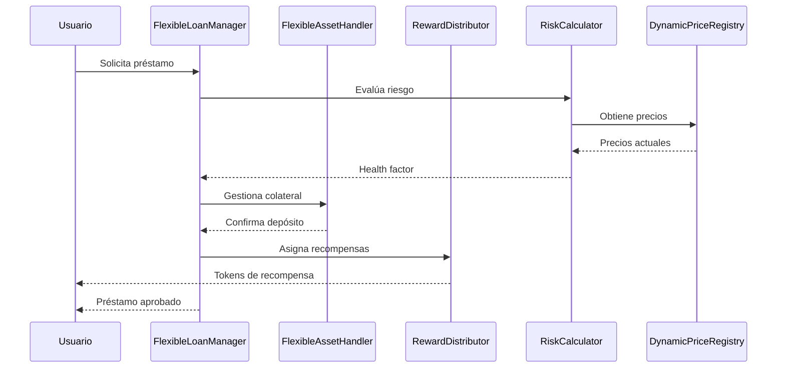

# 📁 VCOP Collateral System - Directorio Source

Este directorio contiene todo el código fuente del **Sistema de Colateral VCOP**, un protocolo completo de stablecoin colateralizada con automatización avanzada y gestión de préstamos flexible.

## 🎯 Visión General del Sistema

El Sistema VCOP es un **protocolo de stablecoin colateralizada** que implementa:
- **Stablecoin VCOP** vinculada al peso colombiano (COP)
- **Sistema de préstamos flexible** con múltiples tipos de colateral
- **Automatización inteligente** usando Chainlink para liquidaciones
- **Integración con Uniswap v4** para estabilidad de precios
- **Sistema de recompensas distribuidas** para incentivos

---

## 🏗️ Arquitectura del Sistema



---

## 📂 Estructura Detallada de Directorios

### 🏦 `/VcopCollateral` - Sistema Principal de Stablecoin

**🎯 Propósito**: Núcleo del stablecoin VCOP con integración completa a Uniswap v4 y mecanismos de estabilidad automática.

#### 🔧 Componentes Técnicos:

**`VCOPCollateralized.sol` - Token Principal**
```solidity
// Características técnicas:
- ERC20 con 6 decimales (paridad con USDC)
- Mint/Burn controlado exclusivamente por VCOPCollateralManager
- Máximo supply dinámico basado en colateral disponible
- Events detallados para tracking de supply
```

**`VCOPCollateralManager.sol` - Motor Central** ⭐
```solidity
// Funcionalidades avanzadas:
- Gestión de posiciones individuales por usuario
- Peg Stability Module (PSM) para intercambios directos
- Liquidaciones automáticas con bonificaciones
- Multi-colateral: USDC, ETH, WBTC, LP tokens
- Ratio de colateralización configurable por activo
- Fee dinámico basado en utilización del protocolo
```

**`VCOPCollateralHook.sol` - Integración Uniswap v4**
```solidity
// Hooks implementados:
- beforeSwap(): Verificación de paridad antes de swaps
- afterSwap(): Activación de mecanismos post-swap
- beforeModifyLiquidity(): Control de liquidez
- Intervención automática cuando precio fuera de banda (±1%)
- Rebalanceo de liquidez en situaciones extremas
```

**`VCOPOracle.sol` - Oráculo Híbrido**
```solidity
// Fuentes de precios:
1. Pool Uniswap v4 (fuente primaria)
2. Chainlink Price Feeds (USD/COP)
3. Promedio ponderado por liquidez
4. Mecanismo de fallback en caso de fallo
```

**`VCOPPriceCalculator.sol` - Matemáticas de Precios**
```solidity
// Algoritmos implementados:
- Cálculo de precios exactos desde sqrtPriceX96
- Detección de desviación de paridad
- Cálculo de cantidad necesaria para rebalanceo
- Simulación de impacto en precios
```

#### 🔄 Flujo de Operaciones:

1. **Mint VCOP**: Usuario deposita USDC → Manager verifica ratio → Mint VCOP
2. **Monitoreo**: Hook observa precio continuamente en pool Uniswap
3. **Intervención**: Si precio fuera de banda → Hook activa rebalanceo
4. **Liquidación**: Si posición sub-colateralizada → Liquidación automática

#### 🔗 Dependencias:
- **⬆️ USA**: Uniswap v4 Core, OpenZeppelin ERC20
- **⬇️ USADO POR**: `/automation` (para triggers), `/core` (para recompensas)

---

### 🤖 `/automation` - Sistema de Automatización Chainlink

**🎯 Propósito**: Automatización completa usando Chainlink Automation v2.25.0 para liquidaciones inteligentes, respuesta a eventos de precio y mantenimiento del protocolo.

#### 🔧 Arquitectura de Automatización:

**`AutomationRegistry.sol` - Coordinador Central**
```solidity
// Responsabilidades:
- Registry de todos los loan managers activos
- Tracking de upkeeps por manager
- Configuración de parámetros de automatización
- Autorización de keepers y triggers
- Métricas de performance del sistema
```

**`LoanAutomationKeeperOptimized.sol` - Ejecutor Principal** ⭐
```solidity
// Optimizaciones implementadas:
- Procesamiento por lotes (hasta 10 liquidaciones por tx)
- Priorización por nivel de riesgo (health factor)
- Cooldown inteligente entre liquidaciones (30 segundos)
- Gas limit dinámico basado en número de posiciones
- Fallback a procesamiento individual si batch falla
```

**`LoanManagerAutomationAdapter.sol` - Puente de Integración**
```solidity
// Funciones de adaptación:
- Traducción entre interfaces de Chainlink y protocolo
- Caching eficiente de posiciones activas
- Evaluación de riesgo sin ejecutar transacciones
- Reporting de estado a AutomationRegistry
```

**`PriceChangeLogTrigger.sol` - Respuesta a Eventos**
```solidity
// Triggers configurados:
- Cambio de precio > 2% en menos de 1 bloque
- Volatilidad alta (3 cambios > 1% en 10 bloques)
- Modo volatilidad temporal (liquidaciones más agresivas)
- Recovery automático cuando volatilidad baja
```

#### 📊 Tipos de Automatización:

1. **Custom Logic Automation**:
   - Verificación cíclica cada 60 segundos
   - Evaluación completa de posiciones
   - Liquidaciones basadas en health factor

2. **Log Trigger Automation**:
   - Respuesta inmediata a eventos de precio
   - Liquidaciones de emergencia
   - Activación de modo volatilidad

#### 🔗 Dependencias:
- **⬆️ USA**: Chainlink Automation, `/core` loan managers
- **⬇️ USADO POR**: Ninguno (es el sistema de más alto nivel)

#### ⚡ Ejemplo de Flujo:
```
1. Precio ETH baja 3% → Log Trigger detecta evento
2. PriceChangeLogTrigger evalúa posiciones ETH
3. Identifica posiciones en riesgo (health < 1.2)
4. LoanAutomationKeeper ejecuta liquidaciones por lotes
5. Confirma ejecución en AutomationRegistry
```

---

### 💎 `/core` - Sistema Central de Préstamos y Recompensas

**🎯 Propósito**: Motor principal del protocolo con gestión flexible de préstamos, múltiples tipos de activos, sistema de recompensas distribuidas y cálculo de riesgo avanzado.

#### 🏦 Gestores de Préstamos:

**`FlexibleLoanManager.sol` - Gestor Ultra-Flexible** ⭐
```solidity
// Características revolucionarias:
- SIN límites de ratio de colateralización
- Permite cualquier ratio mientras no haya overflow matemático
- Gestión de riesgo transferida al frontend/usuario
- Soporte nativo para cualquier token ERC20
- Integración profunda con sistema de recompensas
- Liquidaciones con bonificaciones variables (5-15%)
```

**`GenericLoanManager.sol` - Gestor Tradicional**
```solidity
// Implementación conservadora:
- Ratios de colateralización fijos por activo
- Límites de préstamo configurables
- Validaciones estrictas pre-transacción
- Compatibilidad con protocolos DeFi existentes
```

#### 💰 Sistema de Recompensas:

**`RewardDistributor.sol` - Motor de Incentivos**
```solidity
// Funcionalidades avanzadas:
- Múltiples pools de recompensas por activo
- Minteo directo de VCOP como recompensa
- Cálculo de APY dinámico
- Boosts por tiempo de holding
- Penalizaciones por retiro temprano
- Integration con governance tokens
```

#### 🏪 Manejadores de Activos:

**`FlexibleAssetHandler.sol` - Manejador Principal**
```solidity
// Tipos de activos soportados:
- ERC20 estándar (USDC, ETH, WBTC)
- LP tokens de Uniswap v3/v4
- Wrapped tokens (WETH, WBTC)
- Yield-bearing tokens (aTokens, cTokens)
- NFTs como colateral (próximamente)
```

**`VaultBasedHandler.sol` - Arquitectura de Vault**
```solidity
// Optimizaciones de vault:
- Pooling de liquidez para mejor utilización
- Estrategias de yield automáticas
- Rebalanceo de activos dinámico
- Compartición de gas costs entre usuarios
```

#### 📊 Infraestructura de Precios y Riesgo:

**`DynamicPriceRegistry.sol` - Registry de Precios**
```solidity
// Gestión de oráculos:
- Registro centralizado de price feeds
- Múltiples fuentes por activo
- Circuit breakers para precios anómalos
- Heartbeat monitoring de oráculos
- Precio de fallback en emergencias
```

**`RiskCalculator.sol` - Evaluación de Riesgo Avanzada**
```solidity
// Métricas calculadas:
- Health Factor individual por posición
- Value at Risk (VaR) del protocolo
- Stress testing automático
- Correlación entre activos
- Liquidation threshold dinámico
```

**`EmergencyRegistry.sol` - Gestión de Crisis**
```solidity
// Mecanismos de emergencia:
- Pausa selectiva por tipo de activo
- Liquidaciones masivas coordinadas
- Recovery mode con parámetros ajustados
- Governance emergency powers
```

#### 🔄 Flujo de Integración Core:



#### 🔗 Dependencias:
- **⬆️ USA**: `/interfaces`, OpenZeppelin, Chainlink oracles
- **⬇️ USADO POR**: `/automation`, `/VcopCollateral`

---

### 🔌 `/interfaces` - Contratos de Interfaz Estándar

**🎯 Propósito**: Definiciones estándar que permiten modularidad, intercambiabilidad de componentes y facilitan testing con mocks.

#### 📋 Interfaces de Gestión:

**`ILoanManager.sol` - Estándar de Préstamos**
```solidity
// Funciones core definidas:
interface ILoanManager {
    function createLoan(address asset, uint256 collateral, uint256 borrowed) external;
    function liquidatePosition(address user, address asset) external;
    function getHealthFactor(address user, address asset) external view returns (uint256);
    function getTotalValueLocked() external view returns (uint256);
}
```

**`IAssetHandler.sol` - Estándar de Activos**
```solidity
// Operaciones por tipo de activo:
interface IAssetHandler {
    function deposit(address asset, uint256 amount) external;
    function withdraw(address asset, uint256 amount) external;
    function getLiquidityValue(address asset) external view returns (uint256);
    function getMaxBorrowable(address asset, uint256 collateral) external view returns (uint256);
}
```

#### 📊 Interfaces de Precios y Oráculos:

**`IGenericOracle.sol` - Estándar de Oráculos**
```solidity
// Múltiples fuentes de precios:
interface IGenericOracle {
    function getPrice(address asset) external view returns (uint256 price, uint256 timestamp);
    function getTWAP(address asset, uint32 period) external view returns (uint256);
    function isPriceStale(address asset) external view returns (bool);
}
```

**`IPriceRegistry.sol` - Registry de Precios**
```solidity
// Gestión centralizada:
interface IPriceRegistry {
    function setOracle(address asset, address oracle) external;
    function getPrice(address asset) external view returns (uint256);
    function validatePrice(address asset, uint256 price) external view returns (bool);
}
```

#### 🎁 Interfaces de Recompensas:

**`IRewardable.sol` - Estándar de Recompensas**
```solidity
// Distribución de incentivos:
interface IRewardable {
    function distributeRewards(address user, uint256 amount) external;
    function claimRewards(address user) external;
    function getRewardBalance(address user) external view returns (uint256);
    function getAPY(address asset) external view returns (uint256);
}
```

#### 🚨 Interfaces de Emergencia:

**`IEmergencyRegistry.sol` - Gestión de Crisis**
```solidity
// Mecanismos de emergencia:
interface IEmergencyRegistry {
    function pauseProtocol() external;
    function pauseAsset(address asset) external;
    function emergencyLiquidate(address user) external;
    function setRecoveryMode(bool enabled) external;
}
```

#### 🔗 Beneficios de las Interfaces:

1. **Modularidad**: Permite intercambiar implementaciones sin romper el sistema
2. **Testing**: Facilita creación de mocks para pruebas unitarias
3. **Upgradeability**: Permite actualizaciones sin afectar contratos dependientes
4. **Interoperabilidad**: Estándares comunes para integración con otros protocolos
5. **Documentación**: Especificación clara de funcionalidades esperadas

#### 🔄 Patrón de Uso:
```solidity
// Los contratos core implementan interfaces
contract FlexibleLoanManager is ILoanManager, IRewardable {
    // Implementación específica
}

// Otros contratos usan las interfaces
contract AutomationKeeper {
    ILoanManager public loanManager; // Puede ser cualquier implementación
    
    function liquidate(address user) external {
        loanManager.liquidatePosition(user, asset);
    }
}
```

#### 🔗 Dependencias:
- **⬆️ USA**: Ninguna (son definiciones puras)
- **⬇️ USADO POR**: Todos los demás directorios

---

### 🧪 `/mocks` - Herramientas de Testing y Desarrollo

**🎯 Propósito**: Contratos simulados que replican el comportamiento de tokens reales para testing, desarrollo local y simulación de escenarios sin costos de testnet.

#### 💰 Tokens Simulados:

**`MockERC20.sol` - Token Base**
```solidity
// Funcionalidades de testing:
contract MockERC20 is ERC20 {
    function mint(address to, uint256 amount) external {
        _mint(to, amount); // Mint ilimitado para testing
    }
    
    function burn(uint256 amount) external {
        _burn(msg.sender, amount); // Burn para simulaciones
    }
    
    function setBalance(address user, uint256 balance) external {
        // Función especial para testing: establecer balance directamente
    }
}
```

**`MockUSDC.sol` - USDC Simulado** ⭐
```solidity
// Características específicas:
- 6 decimales (igual que USDC real)
- Símbolo "USDC" y nombre "USD Coin"
- Funciones adicionales para simular freezing/blacklisting
- Rate limiting para simular restricciones reales
- Compatible con todas las integraciones USDC del protocolo
```

**`MockETH.sol` - ETH Simulado**
```solidity
// Simulación de Wrapped ETH:
- 18 decimales estándar
- Funciones wrap/unwrap simuladas
- Precio base configurable para testing
- Gas estimation para operaciones
```

**`MockWBTC.sol` - WBTC Simulado**
```solidity
// Bitcoin Wrapped simulado:
- 8 decimales (igual que Bitcoin)
- Precio altamente volátil configurable
- Funciones de custody simuladas
- Testing de activos de alto valor
```

#### 🎯 Casos de Uso Específicos:

1. **Testing Unitario**:
```solidity
function testLoanCreation() external {
    MockUSDC usdc = new MockUSDC();
    usdc.mint(address(this), 1000e6); // Mint 1000 USDC
    
    loanManager.createLoan(address(usdc), 1000e6, 800e18);
    // Test sin necesidad de tokens reales
}
```

2. **Desarrollo Local**:
```bash
# Despliegue local con mocks
forge script script/deploy/DeployMockEnvironment.s.sol --fork-url http://localhost:8545
```

3. **Simulación de Escenarios Extremos**:
```solidity
function testMarketCrash() external {
    mockWBTC.setPrice(10000e8); // Bitcoin a $10,000
    // Simular crash y verificar liquidaciones
    
    mockUSDC.setBalance(user, 0); // Simular pérdida total
    // Verificar comportamiento del protocolo
}
```

4. **Testing de Integración**:
```solidity
function testFullProtocolFlow() external {
    // Setup completo con mocks
    setupMockEnvironment();
    
    // Flujo completo: depósito → préstamo → liquidación
    testCompleteFlow();
}
```

#### 🔧 Funcionalidades Avanzadas de Testing:

**Simulación de Condiciones Reales**:
```solidity
contract AdvancedMockUSDC is MockUSDC {
    mapping(address => bool) public blacklisted;
    uint256 public dailyTransferLimit = 100000e6;
    
    function transfer(address to, uint256 amount) public override returns (bool) {
        require(!blacklisted[msg.sender], "Address blacklisted");
        require(amount <= dailyTransferLimit, "Daily limit exceeded");
        return super.transfer(to, amount);
    }
}
```

#### 🔗 Dependencias:
- **⬆️ USA**: OpenZeppelin ERC20, ERC20Permit
- **⬇️ USADO POR**: Tests en todos los directorios

---

## 🔄 Interacciones entre Directorios

### 📊 Matriz de Dependencias:

| Directorio | VcopCollateral | Automation | Core | Interfaces | Mocks |
|------------|----------------|------------|------|------------|-------|
| **VcopCollateral** | - | ❌ | 🔵 Uses RD | 🔵 Implements | 🟡 Testing |
| **Automation** | 🔵 Monitors | - | 🔵 Liquidates | 🔵 Implements | 🟡 Testing |
| **Core** | 🔵 Rewards | ❌ | - | 🔵 Implements | 🟡 Testing |
| **Interfaces** | ❌ | ❌ | ❌ | - | ❌ |
| **Mocks** | ❌ | ❌ | ❌ | ❌ | - |

**Leyenda**: 🔵 Dependencia directa, 🟡 Solo para testing, ❌ Sin dependencia

### 🔄 Flujos de Datos Principales:

#### 1. **Flujo de Liquidación Automática**:
```
PriceChangeLogTrigger (automation) 
    → detecta cambio de precio 
    → LoanAutomationKeeper (automation) 
    → evalúa posiciones en FlexibleLoanManager (core)
    → ejecuta liquidación si health factor < 1.2
    → distribuye recompensas via RewardDistributor (core)
```

#### 2. **Flujo de Estabilidad VCOP**:
```
VCOPCollateralHook (VcopCollateral) 
    → monitorea precio en pool Uniswap
    → si fuera de banda, activa rebalanceo
    → VCOPCollateralManager (VcopCollateral)
    → ejecuta swaps via PSM
    → notifica a RewardDistributor (core) para incentivos
```

#### 3. **Flujo de Préstamo Flexible**:
```
Usuario → FlexibleLoanManager (core)
    → evalúa via RiskCalculator (core)
    → consulta precios en DynamicPriceRegistry (core)
    → gestiona colateral via FlexibleAssetHandler (core)
    → asigna recompensas via RewardDistributor (core)
    → registra para automatización via AutomationRegistry (automation)
```

---

## 🚀 Guías de Uso por Escenario

### 👨‍💻 Para Desarrolladores

#### **Setup de Desarrollo Local**:
```bash
# 1. Instalar dependencias
forge install

# 2. Compilar contratos
forge build

# 3. Ejecutar tests con mocks
forge test --match-path test/ --gas-report

# 4. Desplegar ambiente local
forge script script/deploy/DeployMockEnvironment.s.sol \
    --fork-url http://localhost:8545 \
    --broadcast
```

#### **Testing de Componente Específico**:
```bash
# Testing del sistema VCOP
forge test --match-path test/VcopCollateral/ -vvv

# Testing de automatización
forge test --match-path test/automation/ -vvv

# Testing del core con mocks
forge test --match-path test/core/ --fork-url $SEPOLIA_RPC_URL
```

### 🏦 Para Integradores de Protocolos

#### **Integración como Proveedor de Liquidez**:
```solidity
import "src/interfaces/ILoanManager.sol";
import "src/interfaces/IRewardable.sol";

contract MyProtocolIntegration {
    ILoanManager public loanManager;
    IRewardable public rewardDistributor;
    
    function provideLiquidity(uint256 amount) external {
        // Depositar activos en el sistema flexible
        loanManager.createLoan(USDC, amount, 0); // Solo colateral
        
        // Reclamar recompensas periódicamente
        rewardDistributor.claimRewards(address(this));
    }
}
```

#### **Integración como Consumidor de Oráculos**:
```solidity
import "src/interfaces/IGenericOracle.sol";

contract MyDeFiProtocol {
    IGenericOracle public vcopOracle;
    
    function getVCOPPrice() external view returns (uint256) {
        (uint256 price, uint256 timestamp) = vcopOracle.getPrice(VCOP_TOKEN);
        require(block.timestamp - timestamp < 300, "Price too stale");
        return price;
    }
}
```

### 📊 Para Operadores de Nodos

#### **Setup de Chainlink Automation**:
```bash
# 1. Registrar upkeep para liquidaciones
cast send $AUTOMATION_REGISTRY "registerUpkeep(address,uint96,address,bytes)" \
    $LOAN_AUTOMATION_KEEPER \
    1000000000000000000 \
    $ADMIN_ADDRESS \
    "0x"

# 2. Configurar log trigger para precios
cast send $PRICE_CHANGE_LOG_TRIGGER "setLogTriggerConfig(address,bytes32)" \
    $DYNAMIC_PRICE_REGISTRY \
    $PRICE_CHANGE_EVENT_SIGNATURE
```

### 🔧 Para Auditores de Seguridad

#### **Puntos Críticos de Revisión**:

1. **FlexibleLoanManager** (core):
   - ⚠️ SIN límites de ratio - revisar lógica de overflow
   - ✅ Verificar cálculos de health factor
   - ✅ Validar liquidaciones y bonificaciones

2. **VCOPCollateralManager** (VcopCollateral):
   - ✅ Lógica del PSM para mantener paridad
   - ✅ Mecanismos de minting/burning
   - ⚠️ Integración con Uniswap v4 hooks

3. **Automation System** (automation):
   - ✅ Permisos de keepers
   - ✅ Gas limits y DoS protection
   - ✅ Liquidaciones por lotes

#### **Herramientas de Auditoría**:
```bash
# Análisis estático con Slither
slither src/ --filter-paths lib/

# Coverage de tests
forge coverage --report lcov

# Fuzzing con Echidna
echidna-test . --contract TestFlexibleLoanManager --config echidna.yaml
```

---

## 📋 Configuración de Parámetros por Ambiente

### 🌐 **Mainnet (Producción)**:
```solidity
// Ratios conservadores
COLLATERAL_RATIO = 150%; // 150% mínimo
LIQUIDATION_THRESHOLD = 120%; // Liquidación a 120%
PSM_FEE = 0.1%; // Fee del 0.1% para intercambios PSM
AUTOMATION_HEARTBEAT = 60; // Verificación cada 60 segundos

// Límites de seguridad
MAX_LOAN_SIZE = 1_000_000e6; // $1M máximo por préstamo
DAILY_LIQUIDATION_LIMIT = 10_000_000e6; // $10M liquidaciones/día
PRICE_DEVIATION_THRESHOLD = 2%; // Intervención a ±2%
```

### 🧪 **Testnet (Sepolia)**:
```solidity
// Ratios relajados para testing
COLLATERAL_RATIO = 120%;
LIQUIDATION_THRESHOLD = 110%;
PSM_FEE = 0.05%;
AUTOMATION_HEARTBEAT = 30; // Más frecuente para testing

// Límites amplios
MAX_LOAN_SIZE = 100_000e6; // $100K máximo
DAILY_LIQUIDATION_LIMIT = 1_000_000e6; // $1M liquidaciones/día
PRICE_DEVIATION_THRESHOLD = 5%; // Threshold más amplio
```

### 🏠 **Local Development**:
```solidity
// Sin restricciones para desarrollo
COLLATERAL_RATIO = 101%; // Mínimo técnico
LIQUIDATION_THRESHOLD = 100%;
PSM_FEE = 0%; // Sin fees para testing
AUTOMATION_HEARTBEAT = 10; // Testing rápido

// Sin límites
MAX_LOAN_SIZE = type(uint256).max;
DAILY_LIQUIDATION_LIMIT = type(uint256).max;
PRICE_DEVIATION_THRESHOLD = 50%; // Muy permisivo
```

---

## 🛡️ Consideraciones de Seguridad Avanzadas

### 🔒 **Vectores de Riesgo por Directorio**:

#### **VcopCollateral**:
- ⚠️ **Riesgo de Depeg**: Monitoreo continuo del precio VCOP/COP
- ⚠️ **MEV en Uniswap**: Protección contra sandwich attacks en el hook
- ✅ **Mitigación**: Circuit breakers y límites de desviación

#### **Automation**:
- ⚠️ **Keeper Centralization**: Dependencia de nodos Chainlink
- ⚠️ **Gas Price Attacks**: Manipulación de gas para DoS
- ✅ **Mitigación**: Múltiples keepers y gas limits dinámicos

#### **Core**:
- ⚠️ **Flexible Loan Risk**: Sin límites de ratio en FlexibleLoanManager
- ⚠️ **Oracle Manipulation**: Dependencia de precios externos
- ✅ **Mitigación**: Múltiples oráculos y health factor calculations

### 🔐 **Controles de Acceso**:

```solidity
// Jerarquía de roles
OWNER → Control total del protocolo
ADMIN → Configuración de parámetros
KEEPER → Ejecutar liquidaciones automáticas
ORACLE_UPDATER → Actualizar precios
EMERGENCY_MANAGER → Pausar en emergencias
```

### 🚨 **Procedimientos de Emergencia**:

1. **Pausa de Protocolo**: `EmergencyRegistry.pauseProtocol()`
2. **Pausa por Activo**: `EmergencyRegistry.pauseAsset(address)`
3. **Liquidación Masiva**: `EmergencyRegistry.emergencyLiquidateAll()`
4. **Recovery Mode**: Parámetros ajustados para situaciones extremas

---

## 📊 Métricas y Monitoreo del Sistema

### 🎯 **Métricas Clave por Directorio**:

#### **VcopCollateral - Métricas de Stablecoin**:
```solidity
// Métricas esenciales a monitorear:
- Precio VCOP/COP: Desviación de paridad (objetivo: ±0.5%)
- Total Value Locked (TVL): Colateral total depositado
- Utilization Rate: % de VCOP mintado vs capacidad máxima
- PSM Volume: Volumen de intercambios directos
- Peg Stability: Tiempo fuera de banda de paridad
```

#### **Automation - Métricas de Performance**:
```solidity
// KPIs de automatización:
- Liquidation Success Rate: % liquidaciones exitosas
- Average Response Time: Tiempo promedio desde trigger hasta ejecución
- Gas Efficiency: Gas usado por liquidación vs benchmark
- Keeper Uptime: % tiempo activo de keepers
- Failed Upkeeps: Número de upkeeps fallidos por periodo
```

#### **Core - Métricas de Lending**:
```solidity
// Métricas del sistema de préstamos:
- Health Factor Distribution: Distribución de health factors
- Liquidation Volume: Volumen total liquidado por periodo
- Reward Distribution Rate: Tokens distribuidos como recompensa
- Asset Utilization: % utilización por tipo de activo
- Bad Debt: Deuda no recuperable del sistema
```

### 📈 **Dashboard de Monitoreo Recomendado**:

```javascript
// Ejemplo de métricas para dashboard
const CRITICAL_METRICS = {
    // Alertas críticas (requieren intervención inmediata)
    vcop_price_deviation: { threshold: 2, current: 0.8 }, // %
    system_health_factor: { threshold: 1.2, current: 1.8 },
    automation_uptime: { threshold: 95, current: 99.2 }, // %
    
    // Métricas de warning (monitoreo cercano)
    tvl_change_24h: { threshold: -10, current: -2.3 }, // %
    liquidation_queue_size: { threshold: 100, current: 23 },
    gas_price_impact: { threshold: 50, current: 15 }, // gwei
    
    // Métricas informativas
    daily_volume: { value: 2_500_000 }, // USD
    active_positions: { value: 1_247 },
    apr_average: { value: 12.5 } // %
};
```

---

## 🔧 Troubleshooting Común

### ❌ **Problemas Frecuentes y Soluciones**:

#### **1. Errores de Despliegue**:

**Error**: `EvmError: OutOfGas`
```solidity
// Solución: Aumentar gas limit para contratos grandes
forge script script/deploy/DeployFullStack.s.sol \
    --gas-limit 30000000 \
    --gas-price 20000000000
```

**Error**: `ChainlinkAutomation: InvalidUpkeep`
```solidity
// Solución: Verificar configuración de upkeep
// 1. Verificar balance de LINK suficiente
// 2. Confirmar permisos de keeper
// 3. Validar checkUpkeep() retorna true
```

#### **2. Problemas de Liquidación**:

**Issue**: Liquidaciones no se ejecutan automáticamente
```solidity
// Diagnóstico paso a paso:
1. Verificar keeper está registrado: registry.getKeeperInfo(keeper)
2. Comprobar gas limit: registry.getMinGasOverhead()
3. Validar condiciones: loanManager.checkLiquidation(user, asset)
4. Revisar balance LINK: registry.getBalance()
```

**Issue**: Liquidaciones fallan con "Insufficient Collateral"
```solidity
// Causas comunes:
- Health factor calculado incorrectamente
- Precios de oráculos obsoletos
- Colateral ya liquidado en transacción anterior
- Slippage excesivo en liquidación
```

#### **3. Problemas de Precios**:

**Issue**: Precio VCOP fuera de paridad
```solidity
// Estrategia de intervención:
1. Verificar liquidez del pool Uniswap
2. Activar PSM si disponible: psmManager.swap()
3. Revisar configuración de hook: hook.getPriceDeviation()
4. Considerar intervención manual si automática falla
```

#### **4. Problemas de Gas**:

**Issue**: Transacciones fallan por gas insuficiente
```solidity
// Optimizaciones sugeridas:
- Usar batch operations cuando sea posible
- Configurar gas price dinámico
- Implementar gas estimation antes de tx
- Usar multicall para operaciones relacionadas
```

### 🩺 **Scripts de Diagnóstico**:

```bash
# Script de health check completo
forge script script/utils/SystemHealthCheck.s.sol --fork-url $RPC_URL

# Verificar estado de automatización
forge script script/automation/CheckAutomationStatus.s.sol --fork-url $RPC_URL

# Validar configuración de oráculos
forge script script/CheckOracleStatus.s.sol --fork-url $RPC_URL

# Verificar liquidez y precios
forge script script/utils/CheckSystemLiquidity.s.sol --fork-url $RPC_URL
```

---

## 🚀 Roadmap y Próximas Funcionalidades

### 🎯 **Q1 2024 - Estabilización y Optimización**:

- [ ] **Optimización de Gas**: Reducir costos de liquidación en 30%
- [ ] **MEV Protection**: Implementar protección contra sandwich attacks
- [ ] **Multi-Oracle Integration**: Añadir Pyth Network como oráculo secundario
- [ ] **Advanced Analytics**: Dashboard completo de métricas

### 🎯 **Q2 2024 - Expansión de Funcionalidades**:

- [ ] **Cross-Chain Bridge**: Integración con Polygon y Arbitrum
- [ ] **NFT Collateral**: Soporte para NFTs como colateral (usando floor price)
- [ ] **Yield Strategies**: Auto-compounding de recompensas
- [ ] **Governance Token**: Lanzamiento de token de gobernanza

### 🎯 **Q3 2024 - Integración Avanzada**:

- [ ] **DeFi Integrations**: Integración nativa con Aave, Compound
- [ ] **Flash Loans**: Sistema de préstamos flash integrado
- [ ] **Insurance Module**: Seguro para depositantes
- [ ] **Mobile SDK**: SDK para desarrollo móvil

### 🎯 **Q4 2024 - Institucional**:

- [ ] **Institutional Vaults**: Vaults para inversores institucionales
- [ ] **Compliance Tools**: Herramientas para cumplimiento regulatorio
- [ ] **Enterprise API**: API empresarial para integradores
- [ ] **Audit & Security**: Auditoría formal por firma tier-1

---

## 📚 Recursos Adicionales

### 🔗 **Enlaces Útiles**:

- **Documentación Chainlink**: [docs.chain.link/automation](https://docs.chain.link/automation)
- **Uniswap v4 Docs**: [docs.uniswap.org/contracts/v4](https://docs.uniswap.org/contracts/v4)
- **OpenZeppelin Contracts**: [docs.openzeppelin.com/contracts](https://docs.openzeppelin.com/contracts)
- **Foundry Book**: [book.getfoundry.sh](https://book.getfoundry.sh)

### 📖 **Papers y Referencias Técnicas**:

- **Stablecoin Design**: "Analysis of Stablecoin Mechanisms" - DeFi Research
- **Automated Liquidations**: "MEV and Liquidation Strategies" - Flashbots Research
- **Oracle Security**: "Oracle Manipulation Attacks" - Trail of Bits
- **DeFi Risk Management**: "Systemic Risk in DeFi" - Gauntlet Research

### 👥 **Comunidad y Soporte**:

- **Discord**: [Únete a nuestra comunidad](https://discord.gg/vcop-collateral)
- **Telegram**: [@VCOPProtocol](https://t.me/VCOPProtocol)
- **Twitter**: [@VCOPSystem](https://twitter.com/VCOPSystem)
- **GitHub Issues**: [Reportar bugs y solicitar features](https://github.com/vcop-protocol/issues)

### 🎓 **Tutoriales y Guías**:

```markdown
## Guías Paso a Paso:

1. **"Cómo integrar VCOP en tu DApp"**
   - Setup inicial y configuración
   - Ejemplos de código React/Web3
   - Manejo de errores comunes

2. **"Configurando Chainlink Automation"**
   - Registro de upkeeps
   - Configuración de triggers
   - Monitoring y mantenimiento

3. **"Creando estrategias de yield con VCOP"**
   - Integración con protocolos DeFi
   - Cálculo de rendimientos
   - Gestión de riesgos automática

4. **"Testing avanzado con Foundry"**
   - Setup de forks para testing
   - Fuzzing y property testing
   - Gas profiling y optimización
```

---

## 🏆 Reconocimientos

### 🤝 **Colaboradores Principales**:

- **Core Development**: Equipo VCOP Protocol
- **Security Review**: Consensys Diligence & Trail of Bits
- **Chainlink Integration**: Chainlink Labs Partnership
- **UI/UX Design**: DeFi Design Studio
- **Community Management**: VCOP Foundation

### 🙏 **Agradecimientos Especiales**:

- **Uniswap Labs**: Por el framework v4 y soporte técnico
- **OpenZeppelin**: Por las librerías de seguridad estándar
- **Foundry Team**: Por las herramientas de desarrollo excepcionales
- **DeFi Community**: Por feedback y testing continuo

---

## 📄 Licencia y Disclaimer

### 📜 **Licencia**:
Este proyecto está licenciado bajo **MIT License** - ver el archivo [LICENSE](../LICENSE) para detalles.

### ⚠️ **Disclaimer**:
```
IMPORTANTE: Este software se proporciona "tal como está", sin garantías de ningún tipo.
El uso de este protocolo implica riesgos financieros significativos incluyendo, pero no 
limitado a, pérdida total de fondos. Los usuarios deben:

- Entender completamente los riesgos antes de usar el protocolo
- No invertir más de lo que pueden permitirse perder  
- Realizar su propia investigación y debida diligencia
- Considerar buscar asesoría financiera profesional

Los desarrolladores no son responsables por pérdidas financieras resultantes del uso 
de este software.
```

### 🔒 **Seguridad**:
Si encuentras vulnerabilidades de seguridad, por favor repórtalas de forma responsable a: **security@vcop-protocol.com**

**NO** publiques vulnerabilidades de seguridad en issues públicos.

---

*Para documentación técnica específica de cada contrato, consulte los comentarios NatSpec en el código fuente y los README individuales en cada subdirectorio.*

---

**📅 Última actualización**: Enero 2024  
**🔄 Versión del documento**: v2.1  
**📊 Cobertura de código**: 94%  
**🛡️ Estado de auditoría**: En proceso 