# 📁 VCOP Collateral System - Source Directory

This directory contains all the source code for the **VCOP Collateral System**, a complete collateralized stablecoin protocol with advanced automation and flexible loan management.

## 🎯 System Overview

The VCOP System is a **collateralized stablecoin protocol** that implements:
- **VCOP Stablecoin** pegged to the Colombian Peso (COP)
- **Flexible lending system** with multiple collateral types
- **Intelligent automation** using Chainlink for liquidations
- **Uniswap v4 integration** for price stability
- **Distributed rewards system** for incentives

---

## 🏗️ System Architecture

```mermaid
graph TB
    subgraph "🏦 VcopCollateral - Stablecoin Core"
        VC[VCOPCollateralized<br/>💰 Token VCOP]
        VCM[VCOPCollateralManager<br/>🏛️ Main Manager]
        VCH[VCOPCollateralHook<br/>🔗 Hook Uniswap v4]
        VO[VCOPOracle<br/>📊 Price Oracle]
        VPC[VCOPPriceCalculator<br/>🧮 Calculator]
    end
    
    subgraph "⚙️ Automation - Chainlink Integration"
        AR[AutomationRegistry<br/>📋 Central Registry]
        LAK[LoanAutomationKeeper<br/>🤖 Main Keeper]
        LMAA[LoanManagerAdapter<br/>🔌 Adapter]
        PCLT[PriceChangeLogTrigger<br/>⚡ Event Trigger]
    end
    
    subgraph "💎 Core - Lending & Rewards"
        FLM[FlexibleLoanManager<br/>💰 Ultra-Flexible Loans]
        GLM[GenericLoanManager<br/>💼 Standard Loans]
        RD[RewardDistributor<br/>🎁 Reward Distributor]
        FAH[FlexibleAssetHandler<br/>🏪 Asset Handler]
        VBH[VaultBasedHandler<br/>🏦 Vault-Based Handler]
        DPR[DynamicPriceRegistry<br/>💱 Price Registry]
        ER[EmergencyRegistry<br/>🚨 Emergency Registry]
        RC[RiskCalculator<br/>📈 Risk Calculator]
    end
    
    subgraph "🔌 Interfaces - Standard Contracts"
        ILM[ILoanManager<br/>📋 Loan Interface]
        IAH[IAssetHandler<br/>🔧 Asset Interface]
        IGO[IGenericOracle<br/>📊 Oracle Interface]
        IR[IRewardable<br/>🎁 Reward Interface]
    end
    
    subgraph "🧪 Mocks - Testing Tools"
        MUSDC[MockUSDC<br/>💵 Simulated USDC]
        METH[MockETH<br/>⚡ Simulated ETH]
        MWBTC[MockWBTC<br/>₿ Simulated WBTC]
    end
    
    %% Main relationships
    VCM --> VC
    VCH --> VCM
    VO --> VCH
    VPC --> VO
    
    AR --> LAK
    LAK --> LMAA
    LMAA --> FLM
    PCLT --> FLM
    
    FLM --> RD
    FLM --> FAH
    GLM --> RD
    FAH --> VBH
    DPR --> PCLT
    ER --> FLM
    RC --> FLM
    
    %% Implemented interfaces
    FLM -.-> ILM
    GLM -.-> ILM
    FAH -.-> IAH
    VO -.-> IGO
    RD -.-> IR
    
    %% Mocks for testing
    MUSDC -.-> FAH
    METH -.-> FAH
    MWBTC -.-> FAH
    
    classDef vcop fill:#e1f5fe,color:#000
    classDef automation fill:#f3e5f5,color:#000
    classDef core fill:#e8f5e8,color:#000
    classDef interfaces fill:#fff3e0,color:#000
    classDef mocks fill:#fce4ec,color:#000
    
    class VC,VCM,VCH,VO,VPC vcop
    class AR,LAK,LMAA,PCLT automation
    class FLM,GLM,RD,FAH,VBH,DPR,ER,RC core
    class ILM,IAH,IGO,IR interfaces
    class MUSDC,METH,MWBTC mocks
```



---

## 📂 Detailed Directory Structure

### 🏦 `/VcopCollateral` - Main Stablecoin System

**🎯 Purpose**: Core of the VCOP stablecoin with complete Uniswap v4 integration and automatic stability mechanisms.

#### 🔧 Technical Components:

**`VCOPCollateralized.sol` - Main Token**
```solidity
// Technical characteristics:
- ERC20 with 6 decimals (USDC parity)
- Mint/Burn controlled exclusively by VCOPCollateralManager
- Dynamic max supply based on available collateral
- Detailed events for supply tracking
```

**`VCOPCollateralManager.sol` - Central Engine** ⭐
```solidity
// Advanced functionalities:
- Individual position management per user
- Peg Stability Module (PSM) for direct swaps
- Automatic liquidations with bonuses
- Multi-collateral: USDC, ETH, WBTC, LP tokens
- Configurable collateralization ratio per asset
- Dynamic fee based on protocol utilization
```

**`VCOPCollateralHook.sol` - Uniswap v4 Integration**
```solidity
// Implemented hooks:
- beforeSwap(): Parity verification before swaps
- afterSwap(): Post-swap mechanism activation
- beforeModifyLiquidity(): Liquidity control
- Automatic intervention when price out of band (±1%)
- Liquidity rebalancing in extreme situations
```

**`VCOPOracle.sol` - Hybrid Oracle**
```solidity
// Price sources:
1. Uniswap v4 Pool (primary source)
2. Chainlink Price Feeds (USD/COP)
3. Liquidity-weighted average
4. Fallback mechanism in case of failure
```

**`VCOPPriceCalculator.sol` - Price Mathematics**
```solidity
// Implemented algorithms:
- Exact price calculation from sqrtPriceX96
- Parity deviation detection
- Quantity calculation needed for rebalancing
- Price impact simulation
```

#### 🔄 Operations Flow:

1. **Mint VCOP**: User deposits USDC → Manager verifies ratio → Mint VCOP
2. **Monitoring**: Hook continuously observes price in Uniswap pool
3. **Intervention**: If price out of band → Hook activates rebalancing
4. **Liquidation**: If position under-collateralized → Automatic liquidation

#### 🔗 Dependencies:
- **⬆️ USES**: Uniswap v4 Core, OpenZeppelin ERC20
- **⬇️ USED BY**: `/automation` (for triggers), `/core` (for rewards)

---

### 🤖 `/automation` - Chainlink Automation System

**🎯 Purpose**: Complete automation using Chainlink Automation v2.25.0 for intelligent liquidations, price event response, and protocol maintenance.

#### 🔧 Automation Architecture:

**`AutomationRegistry.sol` - Central Coordinator**
```solidity
// Responsibilities:
- Registry of all active loan managers
- Upkeep tracking per manager
- Automation parameter configuration
- Keeper and trigger authorization
- System performance metrics
```

**`LoanAutomationKeeperOptimized.sol` - Main Executor** ⭐
```solidity
// Implemented optimizations:
- Batch processing (up to 10 liquidations per tx)
- Risk level prioritization (health factor)
- Intelligent cooldown between liquidations (30 seconds)
- Dynamic gas limit based on position count
- Fallback to individual processing if batch fails
```

**`LoanManagerAutomationAdapter.sol` - Integration Bridge**
```solidity
// Adaptation functions:
- Translation between Chainlink and protocol interfaces
- Efficient caching of active positions
- Risk evaluation without executing transactions
- Status reporting to AutomationRegistry
```

**`PriceChangeLogTrigger.sol` - Event Response**
```solidity
// Configured triggers:
- Price change > 2% in less than 1 block
- High volatility (3 changes > 1% in 10 blocks)
- Temporary volatility mode (more aggressive liquidations)
- Automatic recovery when volatility drops
```

#### 📊 Automation Types:

1. **Custom Logic Automation**:
   - Cyclical verification every 60 seconds
   - Complete position evaluation
   - Health factor-based liquidations

2. **Log Trigger Automation**:
   - Immediate response to price events
   - Emergency liquidations
   - Volatility mode activation

#### 🔗 Dependencies:
- **⬆️ USES**: Chainlink Automation, `/core` loan managers
- **⬇️ USED BY**: None (it's the highest level system)

#### ⚡ Flow Example:
```
1. ETH price drops 3% → Log Trigger detects event
2. PriceChangeLogTrigger evaluates ETH positions
3. Identifies at-risk positions (health < 1.2)
4. LoanAutomationKeeper executes batch liquidations
5. Confirms execution in AutomationRegistry
```

---

### 💎 `/core` - Central Lending and Rewards System

**🎯 Purpose**: Main protocol engine with flexible loan management, multiple asset types, distributed rewards system, and advanced risk calculation.

#### 🏦 Loan Managers:

**`FlexibleLoanManager.sol` - Ultra-Flexible Manager** ⭐
```solidity
// Innovative characteristics:
- NO collateralization ratio limits
- Allows any ratio as long as there's no mathematical overflow
- Risk management transferred to frontend/user
- Native support for any ERC20 token
- Deep integration with rewards system
- Liquidations with variable bonuses (5-15%)
```

**`GenericLoanManager.sol` - Traditional Manager**
```solidity
// Conservative implementation:
- Fixed collateralization ratios per asset
- Configurable loan limits
- Strict pre-transaction validations
- Compatibility with existing DeFi protocols
```

#### 💰 Rewards System:

**`RewardDistributor.sol` - Incentive Engine**
```solidity
// Advanced functionalities:
- Multiple reward pools per asset
- Direct VCOP minting as reward
- Dynamic APY calculation
- Boosts for holding time
- Early withdrawal penalties
- Integration with governance tokens
```

#### 🏪 Asset Handlers:

**`FlexibleAssetHandler.sol` - Main Handler**
```solidity
// Supported asset types:
- Standard ERC20 (USDC, ETH, WBTC)
- Uniswap v3/v4 LP tokens
- Wrapped tokens (WETH, WBTC)
- Yield-bearing tokens (aTokens, cTokens)
- NFTs as collateral (coming soon)
```

**`VaultBasedHandler.sol` - Vault Architecture**
```solidity
// Vault optimizations:
- Liquidity pooling for better utilization
- Automatic yield strategies
- Dynamic asset rebalancing
- Gas cost sharing among users
```

#### 📊 Price and Risk Infrastructure:

**`DynamicPriceRegistry.sol` - Price Registry**
```solidity
// Oracle management:
- Centralized price feed registry
- Multiple sources per asset
- Circuit breakers for anomalous prices
- Oracle heartbeat monitoring
- Emergency fallback pricing
```

**`RiskCalculator.sol` - Advanced Risk Assessment**
```solidity
// Calculated metrics:
- Individual Health Factor per position
- Protocol Value at Risk (VaR)
- Automatic stress testing
- Asset correlation
- Dynamic liquidation threshold
```

**`EmergencyRegistry.sol` - Crisis Management**
```solidity
// Emergency mechanisms:
- Selective pause by asset type
- Coordinated mass liquidations
- Recovery mode with adjusted parameters
- Governance emergency powers
```

#### 🔄 Core Integration Flow:


#### 🔗 Dependencies:
- **⬆️ USES**: `/interfaces`, OpenZeppelin, Chainlink oracles
- **⬇️ USED BY**: `/automation`, `/VcopCollateral`

---

### 🔌 `/interfaces` - Standard Interface Contracts

**🎯 Purpose**: Standard definitions that enable modularity, component interchangeability, and facilitate testing with mocks.

#### 📋 Management Interfaces:

**`ILoanManager.sol` - Lending Standard**
```solidity
// Core functions defined:
interface ILoanManager {
    function createLoan(address asset, uint256 collateral, uint256 borrowed) external;
    function liquidatePosition(address user, address asset) external;
    function getHealthFactor(address user, address asset) external view returns (uint256);
    function getTotalValueLocked() external view returns (uint256);
}
```

**`IAssetHandler.sol` - Asset Standard**
```solidity
// Operations per asset type:
interface IAssetHandler {
    function deposit(address asset, uint256 amount) external;
    function withdraw(address asset, uint256 amount) external;
    function getLiquidityValue(address asset) external view returns (uint256);
    function getMaxBorrowable(address asset, uint256 collateral) external view returns (uint256);
}
```

#### 📊 Price and Oracle Interfaces:

**`IGenericOracle.sol` - Oracle Standard**
```solidity
// Multiple price sources:
interface IGenericOracle {
    function getPrice(address asset) external view returns (uint256 price, uint256 timestamp);
    function getTWAP(address asset, uint32 period) external view returns (uint256);
    function isPriceStale(address asset) external view returns (bool);
}
```

**`IPriceRegistry.sol` - Price Registry**
```solidity
// Centralized management:
interface IPriceRegistry {
    function setOracle(address asset, address oracle) external;
    function getPrice(address asset) external view returns (uint256);
    function validatePrice(address asset, uint256 price) external view returns (bool);
}
```

#### 🎁 Reward Interfaces:

**`IRewardable.sol` - Reward Standard**
```solidity
// Incentive distribution:
interface IRewardable {
    function distributeRewards(address user, uint256 amount) external;
    function claimRewards(address user) external;
    function getRewardBalance(address user) external view returns (uint256);
    function getAPY(address asset) external view returns (uint256);
}
```

#### 🚨 Emergency Interfaces:

**`IEmergencyRegistry.sol` - Crisis Management**
```solidity
// Emergency mechanisms:
interface IEmergencyRegistry {
    function pauseProtocol() external;
    function pauseAsset(address asset) external;
    function emergencyLiquidate(address user) external;
    function setRecoveryMode(bool enabled) external;
}
```

#### 🔗 Interface Benefits:

1. **Modularity**: Allows swapping implementations without breaking the system
2. **Testing**: Facilitates mock creation for unit testing
3. **Upgradeability**: Enables updates without affecting dependent contracts
4. **Interoperability**: Common standards for integration with other protocols
5. **Documentation**: Clear specification of expected functionalities

#### 🔄 Usage Pattern:
```solidity
// Core contracts implement interfaces
contract FlexibleLoanManager is ILoanManager, IRewardable {
    // Specific implementation
}

// Other contracts use the interfaces
contract AutomationKeeper {
    ILoanManager public loanManager; // Can be any implementation
    
    function liquidate(address user) external {
        loanManager.liquidatePosition(user, asset);
    }
}
```

#### 🔗 Dependencies:
- **⬆️ USES**: None (they are pure definitions)
- **⬇️ USED BY**: All other directories

---

### 🧪 `/mocks` - Testing and Development Tools

**🎯 Purpose**: Simulated contracts that replicate real token behavior for testing, local development, and scenario simulation without testnet costs.

#### 💰 Simulated Tokens:

**`MockERC20.sol` - Base Token**
```solidity
// Testing functionalities:
contract MockERC20 is ERC20 {
    function mint(address to, uint256 amount) external {
        _mint(to, amount); // Unlimited mint for testing
    }
    
    function burn(uint256 amount) external {
        _burn(msg.sender, amount); // Burn for simulations
    }
    
    function setBalance(address user, uint256 balance) external {
        // Special function for testing: set balance directly
    }
}
```

**`MockUSDC.sol` - Simulated USDC** ⭐
```solidity
// Specific characteristics:
- 6 decimals (same as real USDC)
- Symbol "USDC" and name "USD Coin"
- Additional functions to simulate freezing/blacklisting
- Rate limiting to simulate real restrictions
- Compatible with all protocol USDC integrations
```

**`MockETH.sol` - Simulated ETH**
```solidity
// Wrapped ETH simulation:
- 18 standard decimals
- Simulated wrap/unwrap functions
- Configurable base price for testing
- Gas estimation for operations
```

**`MockWBTC.sol` - Simulated WBTC**
```solidity
// Simulated Wrapped Bitcoin:
- 8 decimals (same as Bitcoin)
- Configurable highly volatile price
- Simulated custody functions
- High-value asset testing
```

#### 🎯 Specific Use Cases:

1. **Unit Testing**:
```solidity
function testLoanCreation() external {
    MockUSDC usdc = new MockUSDC();
    usdc.mint(address(this), 1000e6); // Mint 1000 USDC
    
    loanManager.createLoan(address(usdc), 1000e6, 800e18);
    // Test without needing real tokens
}
```

2. **Local Development**:
```bash
# Local deployment with mocks
forge script script/deploy/DeployMockEnvironment.s.sol --fork-url http://localhost:8545
```

3. **Extreme Scenario Simulation**:
```solidity
function testMarketCrash() external {
    mockWBTC.setPrice(10000e8); // Bitcoin at $10,000
    // Simulate crash and verify liquidations
    
    mockUSDC.setBalance(user, 0); // Simulate total loss
    // Verify protocol behavior
}
```

4. **Integration Testing**:
```solidity
function testFullProtocolFlow() external {
    // Complete setup with mocks
    setupMockEnvironment();
    
    // Full flow: deposit → loan → liquidation
    testCompleteFlow();
}
```

#### 🔧 Advanced Testing Functionalities:

**Real Condition Simulation**:
```solidity
contract AdvancedMockUSDC is MockUSDC {
    mapping(address => bool) public blacklisted;
    uint256 public dailyTransferLimit = 100000e6;
    
    function transfer(address to, uint256 amount) public override returns (bool) {
        require(!blacklisted[msg.sender], "Address blacklisted");
        require(amount <= dailyTransferLimit, "Daily limit exceeded");
        return super.transfer(to, amount);
    }
}
```

#### 🔗 Dependencies:
- **⬆️ USES**: OpenZeppelin ERC20, ERC20Permit
- **⬇️ USED BY**: Tests in all directories

---

## 🔄 Directory Interactions

### 📊 Dependency Matrix:

| Directory | VcopCollateral | Automation | Core | Interfaces | Mocks |
|------------|----------------|------------|------|------------|-------|
| **VcopCollateral** | - | ❌ | 🔵 Uses RD | 🔵 Implements | 🟡 Testing |
| **Automation** | 🔵 Monitors | - | 🔵 Liquidates | 🔵 Implements | 🟡 Testing |
| **Core** | 🔵 Rewards | ❌ | - | 🔵 Implements | 🟡 Testing |
| **Interfaces** | ❌ | ❌ | ❌ | - | ❌ |
| **Mocks** | ❌ | ❌ | ❌ | ❌ | - |

**Legend**: 🔵 Direct dependency, 🟡 Testing only, ❌ No dependency

### 🔄 Main Data Flows:

#### 1. **Automatic Liquidation Flow**:
```
PriceChangeLogTrigger (automation) 
    → detects price change 
    → LoanAutomationKeeper (automation) 
    → evaluates positions in FlexibleLoanManager (core)
    → executes liquidation if health factor < 1.2
    → distributes rewards via RewardDistributor (core)
```

#### 2. **VCOP Stability Flow**:
```
VCOPCollateralHook (VcopCollateral) 
    → monitors price in Uniswap pool
    → if out of band, activates rebalancing
    → VCOPCollateralManager (VcopCollateral)
    → executes swaps via PSM
    → notifies RewardDistributor (core) for incentives
```

#### 3. **Flexible Loan Flow**:
```
User → FlexibleLoanManager (core)
    → evaluates via RiskCalculator (core)
    → queries prices in DynamicPriceRegistry (core)
    → manages collateral via FlexibleAssetHandler (core)
    → assigns rewards via RewardDistributor (core)
    → registers for automation via AutomationRegistry (automation)
```

---

## 📋 Parameter Configuration by Environment

### 🌐 **Mainnet (Production)**:
```solidity
// Conservative ratios
COLLATERAL_RATIO = 150%; // 150% minimum
LIQUIDATION_THRESHOLD = 120%; // Liquidation at 120%
PSM_FEE = 0.1%; // 0.1% fee for PSM swaps
AUTOMATION_HEARTBEAT = 60; // Verification every 60 seconds

// Safety limits
MAX_LOAN_SIZE = 1_000_000e6; // $1M maximum per loan
DAILY_LIQUIDATION_LIMIT = 10_000_000e6; // $10M liquidations/day
PRICE_DEVIATION_THRESHOLD = 2%; // Intervention at ±2%
```

### 🧪 **Testnet (Sepolia)**:
```solidity
// Relaxed ratios for testing
COLLATERAL_RATIO = 120%;
LIQUIDATION_THRESHOLD = 110%;
PSM_FEE = 0.05%;
AUTOMATION_HEARTBEAT = 30; // More frequent for testing

// Wide limits
MAX_LOAN_SIZE = 100_000e6; // $100K maximum
DAILY_LIQUIDATION_LIMIT = 1_000_000e6; // $1M liquidations/day
PRICE_DEVIATION_THRESHOLD = 5%; // Wider threshold
```

### 🏠 **Local Development**:
```solidity
// No restrictions for development
COLLATERAL_RATIO = 101%; // Technical minimum
LIQUIDATION_THRESHOLD = 100%;
PSM_FEE = 0%; // No fees for testing
AUTOMATION_HEARTBEAT = 10; // Fast testing

// No limits
MAX_LOAN_SIZE = type(uint256).max;
DAILY_LIQUIDATION_LIMIT = type(uint256).max;
PRICE_DEVIATION_THRESHOLD = 50%; // Very permissive
```

---

## 🛡️ Advanced Security Considerations

### 🔒 **Risk Vectors by Directory**:

#### **VcopCollateral**:
- ⚠️ **Depeg Risk**: Continuous monitoring of VCOP/COP price
- ⚠️ **MEV on Uniswap**: Protection against sandwich attacks in hook
- ✅ **Mitigation**: Circuit breakers and deviation limits

#### **Automation**:
- ⚠️ **Keeper Centralization**: Dependency on Chainlink nodes
- ⚠️ **Gas Price Attacks**: Gas manipulation for DoS
- ✅ **Mitigation**: Multiple keepers and dynamic gas limits

#### **Core**:
- ⚠️ **Flexible Loan Risk**: No ratio limits in FlexibleLoanManager
- ⚠️ **Oracle Manipulation**: Dependency on external prices
- ✅ **Mitigation**: Multiple oracles and health factor calculations

### 🔐 **Access Controls**:

```solidity
// Role hierarchy
OWNER → Total protocol control
ADMIN → Parameter configuration
KEEPER → Execute automatic liquidations
ORACLE_UPDATER → Update prices
EMERGENCY_MANAGER → Pause in emergencies
```

### 🚨 **Emergency Procedures**:

1. **Protocol Pause**: `EmergencyRegistry.pauseProtocol()`
2. **Asset Pause**: `EmergencyRegistry.pauseAsset(address)`
3. **Mass Liquidation**: `EmergencyRegistry.emergencyLiquidateAll()`
4. **Recovery Mode**: Adjusted parameters for extreme situations

---

## 📊 System Metrics and Monitoring

### 🎯 **Key Metrics by Directory**:

#### **VcopCollateral - Stablecoin Metrics**:
```solidity
// Essential metrics to monitor:
- VCOP/COP Price: Parity deviation (target: ±0.5%)
- Total Value Locked (TVL): Total deposited collateral
- Utilization Rate: % of VCOP minted vs maximum capacity
- PSM Volume: Direct swap volume
- Peg Stability: Time out of parity band
```

#### **Automation - Performance Metrics**:
```solidity
// Automation KPIs:
- Liquidation Success Rate: % successful liquidations
- Average Response Time: Average time from trigger to execution
- Gas Efficiency: Gas used per liquidation vs benchmark
- Keeper Uptime: % active time of keepers
- Failed Upkeeps: Number of failed upkeeps per period
```

#### **Core - Lending Metrics**:
```solidity
// Lending system metrics:
- Health Factor Distribution: Distribution of health factors
- Liquidation Volume: Total volume liquidated per period
- Reward Distribution Rate: Tokens distributed as rewards
- Asset Utilization: % utilization per asset type
- Bad Debt: Unrecoverable system debt
```

### 📈 **Recommended Monitoring Dashboard**:

```javascript
// Dashboard metrics example
const CRITICAL_METRICS = {
    // Critical alerts (require immediate intervention)
    vcop_price_deviation: { threshold: 2, current: 0.8 }, // %
    system_health_factor: { threshold: 1.2, current: 1.8 },
    automation_uptime: { threshold: 95, current: 99.2 }, // %
    
    // Warning metrics (close monitoring)
    tvl_change_24h: { threshold: -10, current: -2.3 }, // %
    liquidation_queue_size: { threshold: 100, current: 23 },
    gas_price_impact: { threshold: 50, current: 15 }, // gwei
    
    // Informational metrics
    daily_volume: { value: 2_500_000 }, // USD
    active_positions: { value: 1_247 },
    apr_average: { value: 12.5 } // %
};
```

---

## 🔧 Common Troubleshooting

### ❌ **Frequent Issues and Solutions**:

#### **1. Deployment Errors**:

**Error**: `EvmError: OutOfGas`
```solidity
// Solution: Increase gas limit for large contracts
forge script script/deploy/DeployFullStack.s.sol \
    --gas-limit 30000000 \
    --gas-price 20000000000
```

**Error**: `ChainlinkAutomation: InvalidUpkeep`
```solidity
// Solution: Verify upkeep configuration
// 1. Check sufficient LINK balance
// 2. Confirm keeper permissions
// 3. Validate checkUpkeep() returns true
```

#### **2. Liquidation Issues**:

**Issue**: Liquidations don't execute automatically
```solidity
// Step-by-step diagnosis:
1. Verify keeper is registered: registry.getKeeperInfo(keeper)
2. Check gas limit: registry.getMinGasOverhead()
3. Validate conditions: loanManager.checkLiquidation(user, asset)
4. Review LINK balance: registry.getBalance()
```

**Issue**: Liquidations fail with "Insufficient Collateral"
```solidity
// Common causes:
- Health factor calculated incorrectly
- Stale oracle prices
- Collateral already liquidated in previous transaction
- Excessive slippage in liquidation
```

#### **3. Price Issues**:

**Issue**: VCOP price out of parity
```solidity
// Intervention strategy:
1. Check Uniswap pool liquidity
2. Activate PSM if available: psmManager.swap()
3. Review hook configuration: hook.getPriceDeviation()
4. Consider manual intervention if automatic fails
```

#### **4. Gas Issues**:

**Issue**: Transactions fail due to insufficient gas
```solidity
// Suggested optimizations:
- Use batch operations when possible
- Configure dynamic gas pricing
- Implement gas estimation before tx
- Use multicall for related operations
```

### 🩺 **Diagnostic Scripts**:

```bash
# Complete health check script
forge script script/utils/SystemHealthCheck.s.sol --fork-url $RPC_URL

# Verify automation status
forge script script/automation/CheckAutomationStatus.s.sol --fork-url $RPC_URL

# Validate oracle configuration
forge script script/CheckOracleStatus.s.sol --fork-url $RPC_URL

# Check liquidity and prices
forge script script/utils/CheckSystemLiquidity.s.sol --fork-url $RPC_URL
```

---

*For specific technical documentation of each contract, please refer to the NatSpec comments in the source code and individual READMEs in each subdirectory.* 