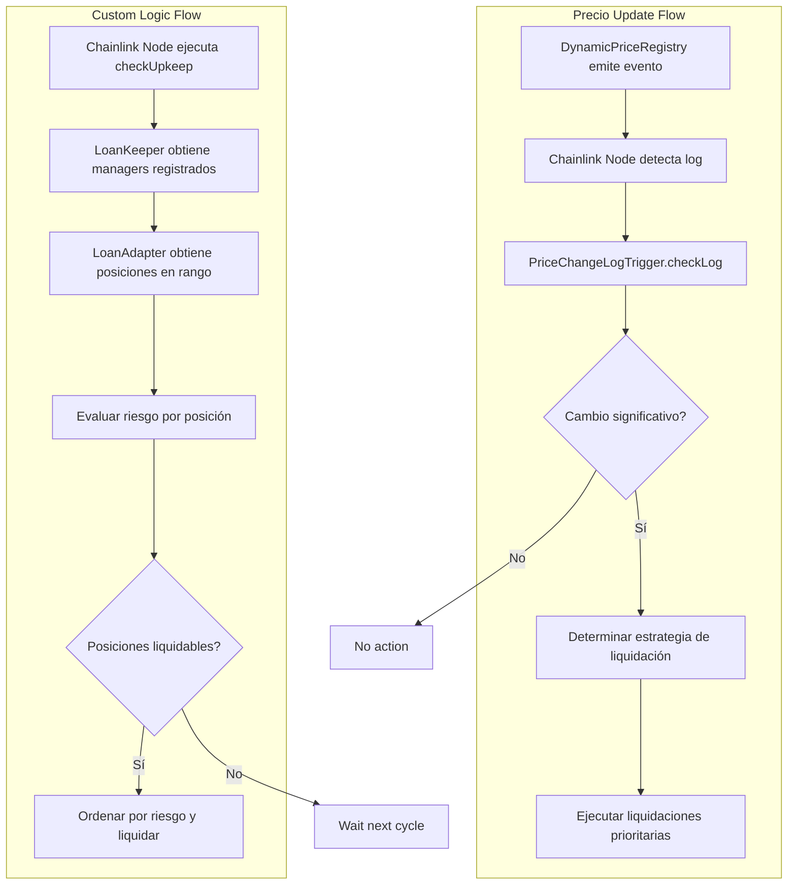

# 🤖 Sistema de Automatización Chainlink Avanzado

## 🚀 Descripción General

Sistema de automatización completo que utiliza **Chainlink Automation v2.25.0** con soporte para `FlexibleLoanManager`, `DynamicPriceRegistry` y liquidaciones automatizadas inteligentes. El sistema implementa tanto **Custom Logic Automation** como **Log Trigger Automation** para máxima eficiencia.

## 🏗️ Arquitectura del Sistema

### Componentes Principales

### 1. **LoanAutomationKeeperOptimized** ⚡ 
**Función**: Keeper principal (Custom Logic Automation)
- **Ubicación**: `src/automation/core/LoanAutomationKeeperOptimized.sol`
- **Propósito**: Ejecuta liquidaciones basadas en lógica personalizada
- **Características**:
  - Extiende `AutomationCompatible` (detección automática UI)
  - Registro interno de loan managers con prioridades
  - Procesamiento por lotes optimizado para gas
  - Priorización por nivel de riesgo
  - Cooldown entre liquidaciones
  - Métricas de rendimiento integradas

### 2. **LoanManagerAutomationAdapter** 🔗
**Función**: Adaptador para FlexibleLoanManager
- **Ubicación**: `src/automation/core/LoanManagerAutomationAdapter.sol`
- **Propósito**: Interfaz entre automatización y lending protocol
- **Características**:
  - Implementa `ILoanAutomation` interface
  - Tracking eficiente de posiciones activas
  - Evaluación de riesgo dinámica
  - Integración directa con `FlexibleLoanManager`

### 3. **PriceChangeLogTrigger** 📈
**Función**: Trigger basado en eventos de precios (Log Automation)
- **Ubicación**: `src/automation/core/PriceChangeLogTrigger.sol`
- **Propósito**: Respuesta inmediata a cambios de precios
- **Características**:
  - Usa `ILogAutomation` interface oficial de Chainlink
  - Registro interno de loan managers con prioridades
  - Detección de volatilidad en tiempo real
  - Múltiples niveles de urgencia (4 niveles)
  - Modo volatilidad temporal
  - Integración directa con `DynamicPriceRegistry`

## 🔄 Flujo de Trabajo Detallado

### Análisis Técnico del Sistema

El sistema de automatización implementa dos tipos de triggers de Chainlink v2.25.0:

1. **Custom Logic Automation**: Ejecución cíclica programada para verificar posiciones
2. **Log Trigger Automation**: Ejecución reactiva basada en eventos de precio

#### Arquitectura del Sistema Actual

El sistema actual funciona de la siguiente manera:

- **LoanAutomationKeeperOptimized**: Maneja su propio registro de loan managers con `registeredManagers` y `managersList`
- **PriceChangeLogTrigger**: Mantiene su propia lista de loan managers con `registeredLoanManagers` y `loanManagersList`  
- **LoanManagerAutomationAdapter**: Implementa `ILoanAutomation` y se conecta directamente con `FlexibleLoanManager`
- **Interfaces Oficiales**: Usa `AutomationCompatible` e `ILogAutomation` de Chainlink v2.25.0

### Ciclo de Custom Logic Automation

### Ciclo de Log Trigger Automation

### Detalles de Implementación Técnica

#### 1. **LoanAutomationKeeperOptimized** - Análisis del Código

```solidity
// 📍 src/automation/core/LoanAutomationKeeperOptimized.sol
contract LoanAutomationKeeperOptimized is AutomationCompatible, Ownable {
    
    // ✅ Extiende AutomationCompatible (no solo interfaz) para detección UI automática
    // ✅ Registro interno de loan managers con sistema de prioridades
    // ✅ Implementa lógica de batching optimizada para gas
    // ✅ Sistema de priorización por riesgo
```

**Características Clave**:
- **Batching Inteligente**: Procesa hasta 200 posiciones por ejecución
- **Ordenamiento por Riesgo**: Prioriza posiciones con mayor riesgo
- **Gas Optimization**: Reserva gas para finalización y previene out-of-gas
- **Cooldown System**: Previene spam de liquidaciones
- **Métricas en Tiempo Real**: Tracking de performance y estadísticas

#### 2. **PriceChangeLogTrigger** - Respuesta a Eventos

```solidity
// 📍 src/automation/core/PriceChangeLogTrigger.sol  
contract PriceChangeLogTrigger is ILogAutomation, Ownable {
    
    // ✅ Usa ILogAutomation interface oficial v2.25.0
    // ✅ Detección de volatilidad multi-nivel
    // ✅ Modo volatilidad temporal (1 hora por defecto)
    // ✅ Estrategias de liquidación dinámicas
```

**Características Técnicas**:
- **Multi-tier Thresholds**: 4 niveles de urgencia (5%, 7.5%, 10%, 15%)
- **Volatility Mode**: Activación automática con parámetros ajustables
- **Price Decoding**: Soporte para múltiples formatos de eventos
- **Asset Filtering**: Liquidación selectiva por activo afectado

#### 3. **LoanManagerAutomationAdapter** - Interfaz Inteligente

```solidity
// 📍 src/automation/core/LoanManagerAutomationAdapter.sol
contract LoanManagerAutomationAdapter is ILoanAutomation, Ownable {
    
    // ✅ Implementa ILoanAutomation interface completa
    // ✅ Tracking eficiente de posiciones activas  
    // ✅ Integración directa con FlexibleLoanManager
    // ✅ Sistema de risk assessment dinámico
```

**Funcionalidades Avanzadas**:
- **Position Tracking**: Array optimizado para iteración eficiente
- **Risk Assessment**: Calcula riesgo basado en `canLiquidate()` y ratio de colateralización
- **Auto-sync**: Limpieza automática de posiciones cerradas
- **Performance Metrics**: Success rate y estadísticas de liquidación

#### 4. **Flujo de Datos en Tiempo Real**



## ⚙️ Configuración del Sistema

### Variables de Entorno

```bash
# Contratos requeridos
FLEXIBLE_LOAN_MANAGER=0x...        # FlexibleLoanManager address
DYNAMIC_PRICE_REGISTRY=0x...       # DynamicPriceRegistry address
PRIVATE_KEY=0x...                  # Deployer private key

# Configuración de automatización
MAX_GAS_PER_UPKEEP=2500000        # Gas máximo por upkeep
MIN_RISK_THRESHOLD=75             # Umbral mínimo de riesgo (%)
LIQUIDATION_COOLDOWN=180          # Cooldown entre liquidaciones (segundos)
ENABLE_VOLATILITY_MODE=true       # Habilitar detección de volatilidad
```

### Umbrales de Riesgo Multi-Nivel

El sistema usa evaluación de riesgo escalonada:

| Nivel | Rango | Color | Acción | Prioridad |
|-------|-------|-------|--------|-----------|
| **🔴 Crítico** | 95%+ | Rojo | Liquidación inmediata | Máxima |
| **🟠 Inmediato** | 85-94% | Naranja | Liquidación alta prioridad | Alta |
| **🟡 Urgente** | 75-84% | Amarillo | Liquidación estándar | Media |
| **🟢 Advertencia** | 60-74% | Verde | Solo monitoreo | Baja |
| **⚪ Seguro** | <60% | Blanco | Sin acción | - |

### Detección de Volatilidad

```solidity
// Umbrales de cambio de precio (base 1,000,000)
priceChangeThreshold = 50000    // 5% - Activación básica
urgentThreshold = 75000         // 7.5% - Nivel urgente  
immediateThreshold = 100000     // 10% - Nivel inmediato
criticalThreshold = 150000      // 15% - Nivel crítico
volatilityBoostThreshold = 100000 // 10% - Modo volatilidad
```

## 🚀 Despliegue paso a paso

### 1. Preparar Entorno

```bash
# Clonar y configurar
git clone <repo>
cd Vcop-Collateral-system-hook-main

# Configurar variables de entorno
cp .env.example .env
# Editar .env con tus valores

# Configurar addresses de contratos desplegados
export FLEXIBLE_LOAN_MANAGER=0x...
export DYNAMIC_PRICE_REGISTRY=0x...
```

### 2. Desplegar Sistema de Automatización

```bash
# Opción A: Despliegue limpio completo
forge script script/automation/DeployAutomationClean.s.sol \
    --broadcast \
    --verify \
    --rpc-url $RPC_URL

# Opción B: Despliegue estándar
forge script script/automation/DeployAutomation.s.sol \
    --broadcast \
    --verify \
    --rpc-url $RPC_URL
```

### 3. Configurar en Chainlink Automation UI

#### Custom Logic Upkeep
```bash
# Obtener checkData para registro
cast call $LOAN_AUTOMATION_KEEPER \
    "generateCheckData(address,uint256,uint256)" \
    $LOAN_ADAPTER_ADDRESS 0 25

# Configuración UI:
# - Contract Address: $LOAN_AUTOMATION_KEEPER  
# - checkData: <resultado del comando anterior>
# - Gas Limit: 2,500,000
# - Funding: Mínimo 10 LINK
```

#### Log Trigger Upkeep
```bash
# Configuración UI:
# - Contract Address: $PRICE_CHANGE_LOG_TRIGGER
# - Log Filter: 
#   - Address: $DYNAMIC_PRICE_REGISTRY
#   - Topic0: TokenPriceUpdated event signature
# - Gas Limit: 2,000,000  
# - Funding: Mínimo 5 LINK
```

## 🔧 Funciones de Configuración

### LoanAutomationKeeperOptimized

```solidity
// Configurar umbrales
loanKeeper.setMinRiskThreshold(75);
loanKeeper.setMaxPositionsPerBatch(25);
loanKeeper.setLiquidationCooldown(180);

// Registrar managers con prioridad
loanKeeper.registerLoanManager(adapterAddress, 100);

// Control de emergencia
loanKeeper.setEmergencyPause(false);
```

### LoanManagerAutomationAdapter

```solidity
// Configurar umbrales dinámicos
loanAdapter.setRiskThresholds(
    95,  // Critical threshold
    85,  // Danger threshold
    75   // Warning threshold  
);

// Configurar cooldown
loanAdapter.setLiquidationCooldown(180);

// Conectar a automatización
loanAdapter.setAutomationContract(loanKeeperAddress);

// Inicializar tracking de posiciones
uint256[] memory existingPositions = getExistingPositions();
loanAdapter.initializePositionTracking(existingPositions);
```

### PriceChangeLogTrigger

```solidity
// Configurar umbrales de precio
priceLogTrigger.setPriceChangeThresholds(
    50000,   // 5% básico
    75000,   // 7.5% urgente
    100000,  // 10% inmediato
    150000   // 15% crítico
);

// Configurar volatilidad
priceLogTrigger.setVolatilityParameters(
    100000, // 10% umbral volatilidad
    3600    // 1 hora duración
);

// Registrar managers
priceLogTrigger.registerLoanManager(adapterAddress, 100);
```

### Estado Actual del Sistema - Funciones Específicas

#### LoanAutomationKeeperOptimized - Funciones Clave

```solidity
// 🔍 Chainlink Automation Interface
function checkUpkeep(bytes calldata checkData) external view override returns (bool upkeepNeeded, bytes memory performData);
function performUpkeep(bytes calldata performData) external override;

// ⚙️ Configuración
function setMinRiskThreshold(uint256 _threshold) external onlyOwner;
function setMaxPositionsPerBatch(uint256 _maxPositions) external onlyOwner;
function registerLoanManager(address loanManager, uint256 priority) external onlyOwner;

// 📊 Estadísticas
function getStats() external view returns (
    uint256 totalLiquidationsCount,
    uint256 totalUpkeepsCount, 
    uint256 lastExecution,
    uint256 averageGasUsed,
    uint256 registeredManagersCount
);

// 🔧 Utilidades
function generateCheckData(address loanManager, uint256 startIndex, uint256 batchSize) external pure returns (bytes memory);
```

#### LoanManagerAutomationAdapter - Interface ILoanAutomation

```solidity
// 📈 Position Management
function getTotalActivePositions() external view returns (uint256);
function getPositionsInRange(uint256 startIndex, uint256 endIndex) external view returns (uint256[] memory);

// ⚠️ Risk Assessment  
function isPositionAtRisk(uint256 positionId) external view returns (bool isAtRisk, uint256 riskLevel);
function getPositionHealthData(uint256 positionId) external view returns (
    address borrower, uint256 collateralValue, uint256 debtValue, uint256 healthFactor
);

// 💥 Liquidación
function automatedLiquidation(uint256 positionId) external returns (bool success, uint256 liquidatedAmount);

// 🔧 Configuration & Tracking
function setRiskThresholds(uint256 _critical, uint256 _danger, uint256 _warning) external onlyOwner;
function initializePositionTracking(uint256[] calldata positionIds) external onlyOwner;
function syncPositionTracking() external;
```

#### PriceChangeLogTrigger - Log Automation

```solidity
// 📊 Chainlink Log Automation Interface
function checkLog(Log calldata log, bytes calldata checkData) external override returns (bool upkeepNeeded, bytes memory performData);
function performUpkeep(bytes calldata performData) external override;

// ⚙️ Configuración de Umbrales
function setPriceChangeThresholds(uint256 _basic, uint256 _urgent, uint256 _immediate, uint256 _critical) external onlyOwner;
function setVolatilityParameters(uint256 _boostThreshold, uint256 _modeDuration) external onlyOwner;

// 📋 Gestión de Managers
function registerLoanManager(address loanManager, uint256 priority) external onlyOwner;

// 📊 Monitoreo
function getAssetPriceData(address asset) external view returns (
    uint256 lastPrice, uint256 lastUpdate, uint256 changeCount, 
    uint256 maxDeviation, bool inVolatilityMode, uint256 volatilityEntered
);
```

### Integración con FlexibleLoanManager

El sistema está específicamente diseñado para trabajar con `FlexibleLoanManager` usando estas funciones:

```solidity
// 🔍 Risk Assessment
flexibleLoanManager.canLiquidate(positionId) → bool
flexibleLoanManager.getCollateralizationRatio(positionId) → uint256

// 💥 Liquidation Execution  
flexibleLoanManager.liquidatePosition(positionId) → executes liquidation

// 📊 Position Data
flexibleLoanManager.getPosition(positionId) → LoanPosition struct
flexibleLoanManager.getTotalDebt(positionId) → uint256
```

### Parámetros de Configuración Actuales

```solidity
// LoanAutomationKeeperOptimized defaults:
minRiskThreshold = 85           // 85% risk para liquidación
maxPositionsPerBatch = 20       // 20 posiciones por batch  
maxGasPerUpkeep = 2000000      // 2M gas máximo
liquidationCooldown = 300       // 5 minutos cooldown

// LoanManagerAutomationAdapter defaults:
criticalRiskThreshold = 95      // 95% = crítico
dangerRiskThreshold = 85        // 85% = peligro  
warningRiskThreshold = 75       // 75% = advertencia
liquidationCooldown = 180       // 3 minutos cooldown

// PriceChangeLogTrigger defaults:
priceChangeThreshold = 50000    // 5% cambio básico
urgentThreshold = 75000         // 7.5% urgente
immediateThreshold = 100000     // 10% inmediato
criticalThreshold = 150000      // 15% crítico
maxPositionsPerTrigger = 30     // 30 posiciones por trigger
volatilityModeDuration = 3600   // 1 hora modo volatilidad
```

## 📊 Monitoreo y Análisis

### Estadísticas del Sistema

```solidity
// Performance del keeper
(uint256 totalLiquidations, 
 uint256 totalUpkeeps, 
 uint256 lastExecution,
 uint256 averageGas,
 uint256 managersCount) = loanKeeper.getStats();

// Estadísticas del adapter
(uint256 tracked,
 uint256 atRisk, 
 uint256 liquidatable,
 uint256 critical,
 uint256 performance) = loanAdapter.getTrackingStats();

// Estadísticas de precios
(uint256 triggers,
 uint256 liquidations,
 uint256 volatilityEvents, 
 uint256 lastTrigger,
 uint256 activeVolatile) = priceLogTrigger.getStatistics();
```

### Monitoreo de Posiciones en Tiempo Real

```solidity
// Obtener todas las posiciones en riesgo
(uint256[] memory riskPositions, 
 uint256[] memory riskLevels) = loanAdapter.getPositionsAtRisk();

// Verificar posición específica
(bool isAtRisk, uint256 riskLevel) = 
    loanAdapter.isPositionAtRisk(positionId);

// Obtener datos de salud de posición
(address borrower,
 uint256 collateralValue,
 uint256 debtValue, 
 uint256 healthFactor) = loanAdapter.getPositionHealthData(positionId);
```

### Datos de Precio y Volatilidad

```solidity
// Datos de seguimiento de precio
(uint256 lastPrice,
 uint256 lastUpdate,
 uint256 changeCount,
 uint256 maxDeviation,
 bool inVolatilityMode,
 uint256 volatilityEntered) = priceLogTrigger.getAssetPriceData(asset);
```

## 🚨 Procedimientos de Emergencia

### Pausa de Emergencia

```solidity
// Pausar todo el sistema
loanKeeper.setEmergencyPause(true);
priceLogTrigger.setEmergencyPause(true);

// Reanudar después de solucionar
loanKeeper.setEmergencyPause(false);
priceLogTrigger.setEmergencyPause(false);
```

### Liquidación Manual

```solidity
// Si falla la automatización, liquidar manualmente
flexibleLoanManager.liquidatePosition(positionId);

// O a través del adapter
loanAdapter.automatedLiquidation(positionId);
```

### Sincronización de Posiciones

```solidity
// Sincronizar tracking de posiciones
loanAdapter.syncPositionTracking();
```

## 🔍 Debugging y Troubleshooting

### Problemas Comunes

#### 1. **Upkeep No Se Ejecuta**
```solidity
// Verificar checkUpkeep manualmente
bytes memory checkData = loanKeeper.generateCheckData(
    adapterAddress, 0, 25
);
(bool needed, bytes memory performData) = 
    loanKeeper.checkUpkeep(checkData);

// Verificar balance LINK
// Verificar configuración de registry
// Verificar que existan posiciones en riesgo
```

#### 2. **Liquidaciones Fallan**
```solidity
// Verificar cooldown
uint256 lastAttempt = 
    loanAdapter.lastLiquidationAttempt(positionId);

// Verificar estado de posición
(bool canLiquidate) = flexibleLoanManager.canLiquidate(positionId);

// Verificar failure count
uint256 failures = 
    loanAdapter.getPositionFailureCount(positionId);
```

#### 3. **Price Triggers No Funcionan**
```solidity
// Verificar configuración de logs
// Verificar emisión de eventos por DynamicPriceRegistry
// Verificar umbrales de cambio de precio
// Verificar balance LINK en log upkeep
```

### Funciones de Debug

```solidity
// Test checkUpkeep
function testCheckUpkeep() external view {
    bytes memory checkData = abi.encode(adapterAddress, 0, 25);
    (bool needed, bytes memory performData) = 
        loanKeeper.checkUpkeep(checkData);
    
    if (needed) {
        // Decodificar performData para análisis
        (address manager, uint256[] memory positions, 
         uint256[] memory risks,) = 
            abi.decode(performData, (address, uint256[], uint256[], uint256));
    }
}

// Verificar configuración del sistema
function verifySystemConfiguration() external view {
    // Verificar manager registrado
require(loanKeeper.registeredManagers(adapterAddress), 
        "Manager not registered");
    
    // Verificar adapter
    require(loanAdapter.isAutomationEnabled(), 
            "Automation not enabled");
    
    // Verificar keeper
    require(!loanKeeper.emergencyPause(), 
            "Emergency pause active");
}
```

## 🎯 Mejores Prácticas

### Optimización de Gas

- **Batch Size**: Comenzar con 25 posiciones, ajustar según uso de gas
- **Risk Thresholds**: Usar 75% mínimo para balance seguridad/eficiencia
- **Cooldown**: Mínimo 3 minutos para prevenir spam
- **Gas Limits**: 2.5M para custom logic, 2M para log triggers

### Gestión de Riesgo

- **Monitoreo Activo**: Revisar métricas diariamente
- **Alertas**: Configurar notificaciones para failures
- **Respaldo**: Mantener procedimientos de liquidación manual
- **Testing**: Probar con posiciones de prueba regularmente

### Rendimiento

- **Métricas**: Trackear success rate de liquidaciones
- **Volatilidad**: Ajustar parámetros según condiciones de mercado
- **Funding**: Mantener balance LINK adecuado
- **Actualizaciones**: Sincronizar posiciones periódicamente
## 📚 Recursos Adicionales

- [Documentación Chainlink Automation](https://docs.chain.link/chainlink-automation)
- [FlexibleLoanManager Guide](../core/README.md)
- [DynamicPriceRegistry Documentation](../interfaces/IPriceRegistry.sol)
- [Interface ILoanAutomation](./interfaces/ILoanAutomation.sol)

---

## 📈 Especificaciones Técnicas

### Versiones Chainlink
- **AutomationCompatible**: v2.25.0
- **ILogAutomation**: v2.25.0  
- **Interfaces**: Oficiales Chainlink

### Compatibilidad
- **Solidity**: ^0.8.24 - ^0.8.26
- **FlexibleLoanManager**: ✅ Completamente integrado
- **DynamicPriceRegistry**: ✅ Soporte nativo
- **Multi-Asset**: ✅ Soporte completo

### Límites del Sistema
- **Max Batch Size**: 200 posiciones
- **Max Gas per Upkeep**: 5,000,000
- **Min Cooldown**: 60 segundos
- **Max Managers**: Ilimitado (gas permitting)

---

## 🎯 Resumen Ejecutivo del Sistema Actual

### Características Principales Implementadas

✅ **Chainlink Automation v2.25.0** - Última versión con `AutomationCompatible` e `ILogAutomation`  
✅ **Dual Trigger System** - Custom Logic + Log Triggers para cobertura completa  
✅ **FlexibleLoanManager Integration** - Integración nativa con liquidaciones optimizadas  
✅ **Dynamic Price Monitoring** - Respuesta inmediata a cambios del `DynamicPriceRegistry`  
✅ **Multi-tier Risk Assessment** - 4 niveles de urgencia con estrategias diferenciadas  
✅ **Volatility Detection** - Modo especial para alta volatilidad de mercado  
✅ **Gas Optimization** - Batching inteligente y gestión eficiente de gas  
✅ **Position Tracking** - Sistema de tracking automático de posiciones activas  
✅ **Performance Metrics** - Estadísticas completas y monitoreo en tiempo real  
✅ **Emergency Controls** - Pausas de emergencia y procedimientos de respaldo  

### Ventajas Técnicas del Sistema

🚀 **Escalabilidad**: Soporte para múltiples loan managers simultáneos  
🛡️ **Seguridad**: Cooldowns, authorization patterns y emergency controls  
⚡ **Eficiencia**: Gas optimizado con batching y priorización inteligente  
🎯 **Precisión**: Risk assessment basado en datos reales del protocolo  
🔄 **Flexibilidad**: Parámetros configurables y adaptables a condiciones del mercado  
📊 **Observabilidad**: Métricas detalladas y funciones de debugging  

### Estado de Implementación

| Componente | Estado | Funcionalidad |
|------------|--------|---------------|
| **LoanAutomationKeeper** | ✅ Optimizado | Custom logic automation con batching y registro interno |
| **LoanManagerAdapter** | ✅ Integrado | Interface con FlexibleLoanManager |
| **PriceChangeLogTrigger** | ✅ Avanzado | Log automation con detección de volatilidad y registro interno |
| **Deployment Scripts** | ✅ Funcionales | Scripts de despliegue automatizado |
| **Configuration Tools** | ✅ Disponibles | Funciones de configuración completas |
| **Chainlink Integration** | ✅ Oficial | Usa interfaces oficiales AutomationCompatible e ILogAutomation |

### Próximos Pasos Recomendados

1. **Deployment**: Usar `DeployAutomationClean.s.sol` para despliegue completo
2. **Configuration**: Configurar umbrales según condiciones específicas del mercado
3. **Registration**: Registrar upkeeps en Chainlink Automation UI
4. **Monitoring**: Implementar alertas basadas en métricas del sistema
5. **Testing**: Ejecutar pruebas con posiciones de prueba antes de producción
6. **Optimization**: Ajustar parámetros basado en performance real

El sistema está diseñado para máxima eficiencia, seguridad y flexibilidad en el manejo automatizado de liquidaciones en el protocolo de lending.